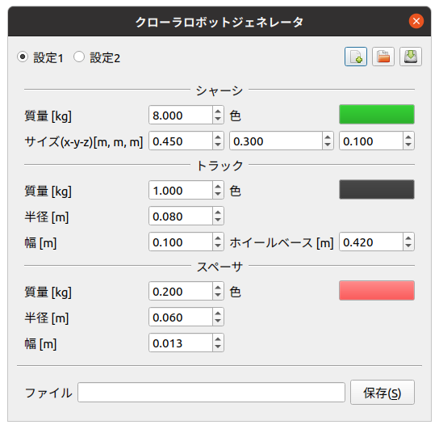
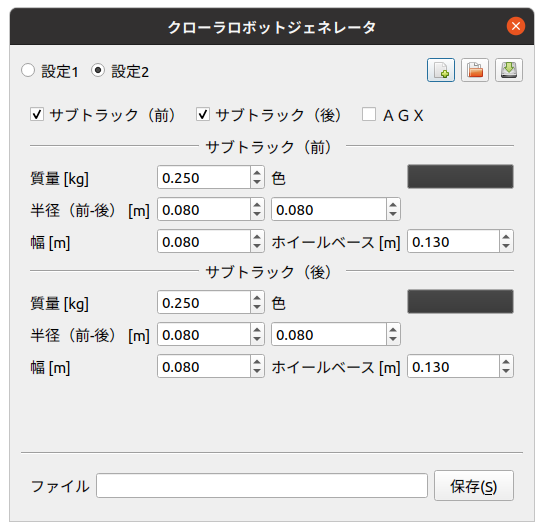

クローラロボットモデルの生成
============================

ここでは、クローラロボットビルダを使ったクローラロボットモデルの生成の仕方を説明します。

クローラロボットモデルの構造
----------------------------

クローラロボットビルダでは、下図の構造のクローラロボットモデルを生成します。

.. image:: images/crawler_0.png

クローラロボットモデルの作成
----------------------------

以下の手順で、クローラロボットモデルを作成します。

1. 「メニュー」-「ツール」-「Bodyファイルの生成」から「クローラロボット」を選択する。
2. ダイアログの各パラメータを入力し、「保存」を押す。上書きの場合は、「上書き保存」を押す。
3. ファイル名を入力、保存場所を指定し、「保存」を押す。

下図は、クローラロボットビルダのダイアログです。

各項目に入力した数値を保存するときは、ダイアログ下の「エクスポート」を押し、YAMLファイルを保存してください。復元するときは、「インポート」を押し、YAMLファイルを読み込んでください。

