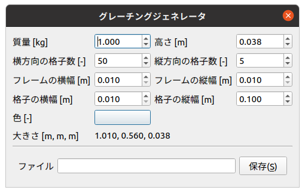

BodyEditプラグイン(グレーチングモデルの生成)
============================================

ここでは、グレーチングビルダを使ったグレーチングモデルの生成の仕方を説明します。

グレーチングモデルの構造とパラメータ
------------------------------------

下図は、グレーチングモデルの構造です。

.. image:: images/grating_0.png

グレーチングモデルの作成
------------------------

以下の手順でグレーチングモデルを作成します。

1. 「メニュー」-「ツール」-「ボディジェネレータ」から「グレーチング」を選択する。
2. ダイアログの各パラメータを入力し、「保存」を押す。上書きの場合は、「上書き保存」を押す。
3. ファイル名を入力、保存場所を指定し、「保存」を押す。

下図は、グレーチングビルダのダイアログです。

