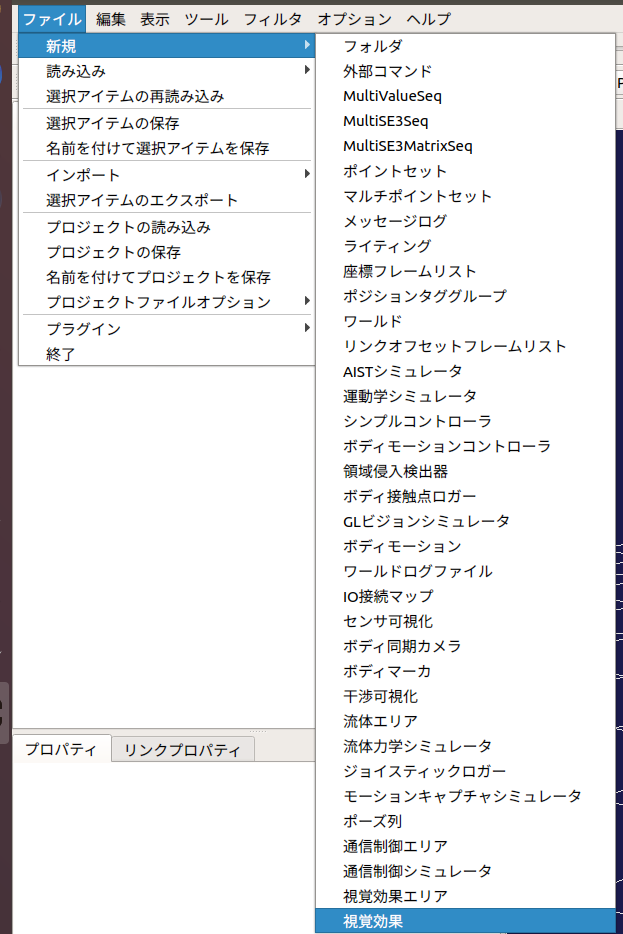
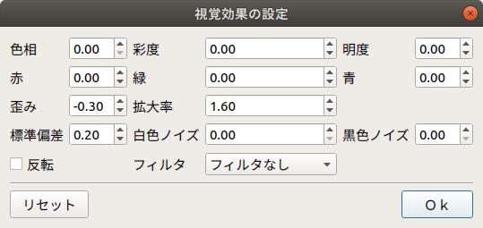

カメラ画像のシミュレーション
============================

ここでは、ビジュアルエフェクタを使ったカメラ画像のシミュレートの仕方を説明します。

画像ビューの生成
----------------

ビジュアルエフェクタによって視覚効果が付与されたカメラ画像は、「画像ビュー」に表示されます。
メインメニューの「表示」-「ビューの表示」-「画像」から画像ビューを生成してください。

.. image:: images/image_0.png

画像ビューバーの生成
--------------------

シミュレートするカメラの選択とカメラ画像に付与する効果の設定には、画像ビューバーを使用します。メインメニュー「表示」-「ツールバーの表示」-「画像ビューバー」から画像ビューバーを生成してください。

.. image:: images/image_1.png

ビジュアルエフェクタの作成と設定
----------------------------------

シミュレーションの実行主体となるビジュアルエフェクタを生成します。

ここではChoreonoidの標準のシミュレータアイテムである「AISTシミュレータ」を用います。
メインメニューの「ファイル」-「新規」-「視覚効果」を選択して生成してください。生成したビジュアルエフェクタは、任意のボディアイテムの子アイテムとして配置します。
ボディアイテムの子アイテムにビジュアルエフェクタを設定すると、ボディに設定されているカメラ毎にVEImageVisualizerItemが自動生成されます。この自動生成されたアイテムのチェックボックスにチェックしたカメラが、画像ビューバーのコンボボックスに登録されます。
次に、メインメニューの「ファイル」-「新規」-「GLビジョンシミュレータ」を選択して生成してください。GLビジョンシミュレータはAISTシミュレータアイテムの子アイテムとして配置します。

視覚効果の設定
--------------

ビジュアルエフェクタの子アイテムとして生成されたVEImageVisualizerItemから任意のアイテムを選択し、右クリックをしてください。右クリックをして表示されたポップアップメニューから、「視覚効果」を選択すると以下のダイアログが表示されます。このダイアログで設定したパラメータに基づいてカメラ画像に視覚効果が付与されます。

ビジュアルエフェクタでは、以下の視覚効果をカメラ画像に付与することができます。

.. list-table::
  :widths: 20,12,8,75
  :header-rows: 1

  * - パラメータ
    - デフォルト値
    - 単位
    - 意味
  * - 色相
    - 0
    - \-
    - 色相を調整します。
  * - 彩度
    - 0
    - \-
    - 彩度を調整します。
  * - 明度
    - 0
    - \-
    - 明度を調整します。
  * - 赤
    - 0
    - \-
    - 赤色の輝度を調整します。
  * - 緑
    - 0
    - \-
    - 緑色の輝度を調整します。
  * - 青
    - 0
    - \-
    - 青色の輝度を調整します。
  * - 歪み
    - 0
    - \-
    - 樽型歪みの度合いを調整します。
  * - 拡大率
    - 0
    - \-
    - 拡大率を調整します。
  * - 標準偏差
    - 1
    - \-
    - ガウシアンノイズの度合いを調整します。
  * - 白色ノイズ
    - 0
    - \-
    - ゴマ塩ノイズの白色の生成確率を調整します。
  * - 黒色ノイズ
    - 0
    - \-
    - ゴマ塩ノイズの黒色の生成確率を調整します。
  * - 反転
    - false
    - \-
    - 画像の上下と左右を反転します。
  * - フィルタ
    - フィルタなし
    - \-
    - 画像に指定したフィルタを適用します。（フィルタなし/ガウシアン3x3/ガウシアン5x5/ソーベル/プリューウィット）

視覚効果エリアの設定
--------------------

視覚効果エリアは、視覚効果を動的に付与するためのアイテムです。メインメニューの「ファイル」-「新規」-「視覚効果エリア」を選択して生成してください。生成した視覚効果エリアは、ワールドアイテムの子アイテムとして配置します。視覚効果エリアを設定することで、ユーザが指定した領域にカメラが設定されたリンクが進入したときに、その領域に進入したカメラに視覚効果が付与されます。

視覚効果エリアでは、上述のパラメータと以下のパラメータを設定できます。

.. list-table::
  :widths: 20,12,12,75
  :header-rows: 1

  * - パラメータ
    - デフォルト値
    - 単位
    - 意味
  * - 形状
    - Box
    - \-
    - 視覚効果エリアの形状を指定します。(Box/Cylinder/Sphere)
  * - サイズ
    - 1.0, 1.0, 1.0
    - m, m, m
    - 視覚効果エリアのサイズをXYZで指定します。（形状がBoxの場合のみ）
  * - 半径
    - 1.0
    - m
    - 視覚効果エリアの半径を指定します。（形状がCylinder・Sphereの場合のみ）
  * - 高さ
    - 1.0
    - m
    - 視覚効果エリアの高さを指定します。（形状がCylinderの場合のみ）
  * - 位置
    - 0, 0, 0
    - m, m, m
    - 視覚効果エリアの位置をXYZで指定します。
  * - RPY
    - 0, 0, 0
    - deg, deg, deg
    - 視覚効果エリアの向きをRoll, Pitch, Yawで指定します。
  * - 拡散色
    - 0, 0, 0
    - \-, -, -
    - 視覚効果エリアの拡散色ををRGBで指定します。
  * - 透過度
    - 0
    - \-
    - 視覚効果エリアの透過度を指定します。

シミュレーションの実行
----------------------

シミュレーションバーから通常通りシミュレーションを実行してください。任意の画像ビューを選択し、画像ビューバーのコンボボックスからカメラを選択するとカメラ画像が表示されます。
以下は、歪みを-0.3、拡大率を1.7とした場合のカメラ画像の例です。

.. image:: images/image_4.png

