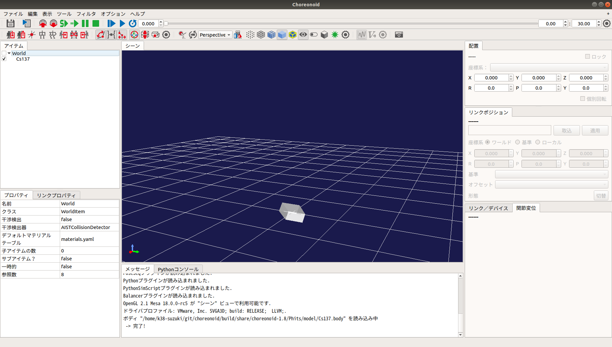
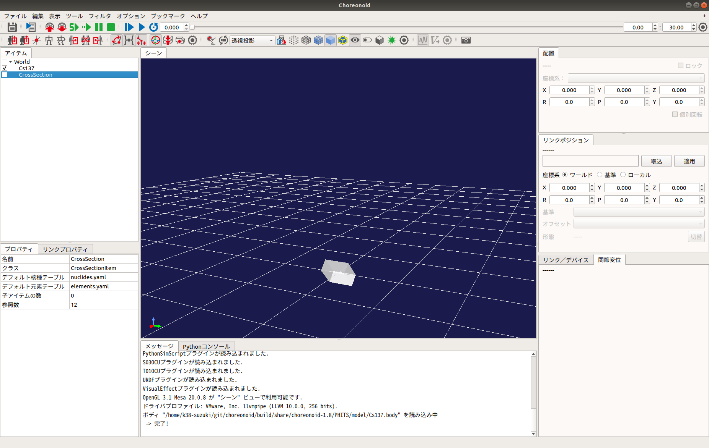
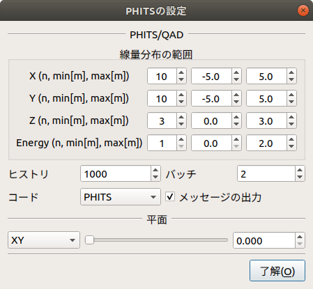
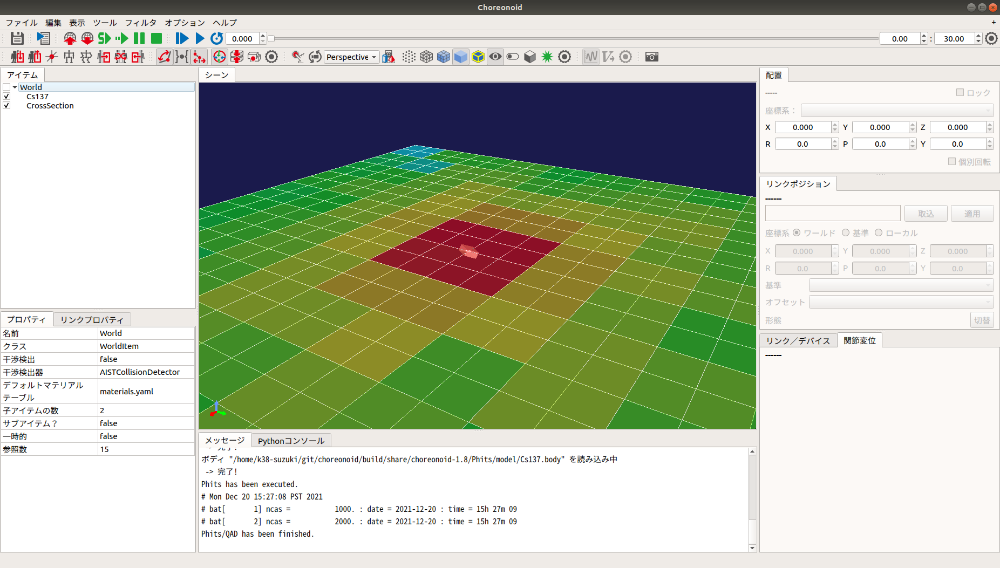
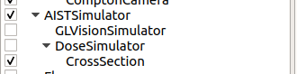
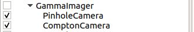
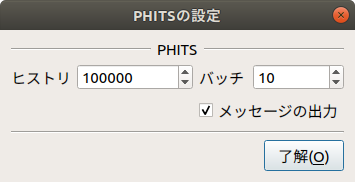

放射線挙動のシミュレーション
============================

　ここでは、PHITSプラグインを使った放射線挙動の計算・可視化の仕方を説明します。なお、PHITSプラグインを使用する際は、事前に「PHITSコード」の入手・インストールが必要です。入手方法については `PHITSコード（実行形式，ソースプログラム，マニュアルなど含む）の入手方法 <https://phits.jaea.go.jp/getj.html>`_ を参照してください。

CMakeによるビルド設定
---------------------

　まず、cmakeコマンドを使ってMakefileを更新します。Choreonoidのビルドディレクトリ上で ::

 cmake ..

を実行すると、必要なライブラリをチェックしMakefileを更新します。(cmakeコマンドのあとのピリオドに注意してください。）

次にPHITSプラグインを有効にします。Choreonoidのビルドディレクトリ上でccmakeコマンドを ::

 ccmake ..

と実行し、**BUILD_PHITS_PLUGIN** を "ON" にします。

Choreonoidのビルドとインストール
--------------------------------

CMakeによりMakefileの生成が成功すれば、makeコマンドでChoreonoidをビルドします。Choreonoidのビルドとインストールについては `Choreonoidのビルド <https://choreonoid.org/ja/manuals/latest/install/build-ubuntu.html>`_ 以降を参照してください。

線量率分布の計算
----------------

　線量率分布の計算には、ボディアイテム（動的モデル）と「線量分布アイテム」を使用します。まず、「線源」または「遮蔽材」を設定します。本機能では、リンク毎に「線源」または「遮蔽材」の属性を追記することで、そのリンクを「線源」または「遮蔽材」のオブジェクトとして扱います。「線源」および「遮蔽材」の属性を追記するためのパラメータは以下のとおりです。

.. list-table::
  :widths: 20,16,12,75
  :header-rows: 1

  * - パラメータ
    - デフォルト値
    - 単位
    - 意味
  * - nuclide
    - \-, -
    - \-, Bq/cm3
    - 核種（Cs-134, Cs-137, Co-60）を指定します。核種は、nuclides.yamlを編集することで追加することができます。
  * - objectType
    - 0.0, 0.0, 0.0
    - m, m, m
    - オブジェクトの種類（線源：SRC_BOX, SRC_CYLINDER, SRC_SPHERE, 遮蔽材：OBS_BOX, OBS_CYLINDER, OBS_SPHERE）を指定します。
  * - material
    - \-
    - \-
    - オブジェクトの物質組成（Air, Water, Concrete, Tungsten, Lead, Iron, Soil, GAGG）を指定します。オブジェクトの物質組成は、elements.yamlを編集することで追加することができます。
  * - sourceDivision
    - \-, -, -
    - \-, -, -
    - 線源の分割数（BOX[x, y, z], CYLINDER[r, phi, z], SPEHRE[r, phi, theta]）を指定します。※QADのみ
  * - buildupFactor
    - \-
    - \-
    - ビルドアップファクタ（BERY, BORO, CARB, NITR, OXYG, SODI, MAGN, ALUM, SILIL, PHOS, SULP, ARGO, POTA, CALC, IRON, COPP, MOLY, TIN, LANT, GADO, TUNG, LEAD, URAN, WATE, CONC, AIR）を指定します。※QADのみ

　次に、「線源」または「遮蔽材」をワールドに配置します。メインメニューの「ファイル」-「読み込み」-「ボディ」を選択して、「線源」または「遮蔽材」の属性が追記されているボディアイテムを読み込みます。続けて、読み込んだボディアイテムの座標を「配置」ビュー等で編集し、初期位置を設定してください。

　次に、線量率分布を計算します。メインメニューの「ファイル」-「新規」-「線量分布」を選択して生成してください。生成した線量分布アイテムは、任意のアイテムの子アイテムとして配置します。

続けて、アイテムツリーで生成した線量分布アイテムを右クリックしてください。右クリックをして表示されたポップアップメニューから、「PHITSの設定」を選択すると以下のダイアログが表示されます。

設定が終了したら、ダイアログを閉じ、アイテムツリーで生成した線量分布アイテムを右クリックしてください。右クリックをして表示されたポップアップメニューから、「PHITS」-「開始」を選択するとダイアログで設定したパラメータに基づいてPHITS/QADが実行されます。演算が完了すると線量分布アイテムの状態が更新され、線量率分布がワールドに表示されます。なお、アイテムツリーの線量分布アイテムのチェックを外すと非表示になります。

ダイアログのパラメータの詳細は以下のとおりです。

.. list-table::
  :widths: 20,16,12,75
  :header-rows: 1

  * - パラメータ
    - デフォルト値
    - 単位
    - 意味
  * - X
    - 3, -1.0, 1.0
    - \-, m, m
    - X軸方向の線量分布の範囲（分割数, 最小, 最大）を指定します。
  * - Y
    - 3, -1.0, 1.0
    - \-, m, m
    - Y軸方向の線量分布の範囲（分割数, 最小, 最大）を指定します。
  * - Z
    - 3, -1.0, 1.0
    - \-, m, m
    - Z軸方向の線量分布の範囲（分割数, 最小, 最大）を指定します。
  * - Energy
    - 1, 0.0, 10.0
    - \-, ?, ?
    - エネルギの範囲（分割数, 最小, 最大）を指定します。
  * - ヒストリ
    - 1000
    - \-
    - PHITSまたはQADの演算の統計精度を指定します。
  * - バッチ
    - 2
    - \-
    - PHITSまたはQADの演算の試行回数を指定します。
  * - コード
    - PHITS
    - \-
    - 演算に使用する計算コードを指定します。（PHITS／QAD）
  * - メッセージの出力
    - checked
    - \-
    - メッセージの出力／非出力を指定します。
  * - リセット
    - \-
    - \-
    - PHITSまたはQADの入力ファイルのパスをクリアします。
  * - 平面
    - XY, 0.000
    - \-, m
    - 線量分布アイテムの平面の向き（XY, YZ, ZX）と代表座標を指定します。

累積線量の取得
--------------

　累積線量の取得には、「線量シミュレータアイテム」と「ガンマ線検出器(DoseMeter)」デバイスを使用します。DoseMeterは、カメラやライト等と同様に任意のリンクのelements以下に記述します。

.. code-block:: yaml

      -
        type: DoseMeter
        name: DoseMeter
        material: LEAD
        thickness: 3
        offsetDose: 3.0

各キーの詳細は以下の通りです。

.. list-table::
  :widths: 20,12,8,75
  :header-rows: 1

  * - パラメータ
    - デフォルト値
    - 単位
    - 意味
  * - type
    - \-
    - \-
    - デバイスの種類を指定します。
  * - name
    - \-
    - \-
    - デバイスの名前を指定します。
  * - material
    - \-
    - \-
    - 遮蔽体物質（LEAD, IRON, CONCRETE）を指定します。遮蔽体物質は、shields.yamlを編集することで追加することができます。
  * - thickness
    - \-
    - \-
    - 遮蔽体物質の厚さを指定します。
  * - offsetDose
    - \-
    - uSv
    - 累積線量の初期値を指定します。

　次に、線量シミュレータアイテムを設定します。メインメニューの「ファイル」-「新規」-「線量シミュレータ」を選択して生成してください。生成した線量シミュレータは、AISTシミュレータアイテムの子アイテムとして配置します。

　次に、累積線量の計算に使用する線量分布アイテムを線量シミュレータの子アイテムに設定してください。複数の線量分布アイテムが子アイテムに設定されている場合は、先頭のアイテムが計算に使用されます。

　シミュレーションバーから通常通りシミュレーションを実行すると、累積線量が計算され、DoseMeterの状態が更新されます。計算された累積線量はDoseMeterクラスのintegralDose()から取得できます。

ピンホールカメラ／コンプトンカメラ画像の生成
--------------------------------------------

　ピンホールカメラ／コンプトンカメラ画像の生成には、「ガンマイメージャアイテム」と「ピンホールカメラ(PinholeCamera)」／「コンプトンカメラ(ComptonCamera)」デバイスを使用します。PinholeCamera／ComptonCameraは、カメラやライト等と同様に任意のリンクのelements以下に記述します。

.. code-block:: yaml

      -
        type: PinholeCamera
        name: PinholeCamera
        rotation: [ [ 1, 0, 0, 90 ], [ 0, 1, 0, -90 ] ]
        format: COLOR
        fieldOfView: 62
        width: 240
        height: 240
        frameRate: 30
        on: true
        resolution: [ 10, 10 ]
        material: Tungsten
        thickness: 3.0
        pinholeOpening: 0.5

各キーの詳細は以下の通りです。

.. list-table::
  :widths: 20,12,8,75
  :header-rows: 1

  * - パラメータ
    - デフォルト値
    - 単位
    - 意味
  * - type
    - \-
    - \-
    - デバイスの種類を指定します。
  * - name
    - \-
    - \-
    - デバイスの名前を指定します。
  * - resolution
    - 8, 8
    - \-, -
    - 解像度を指定します。
  * - material
    - \-
    - \-
    - 遮蔽材の物質組成（Air, Water, Concrete, Tungsten, Lead, Iron, Soil, GAGG）を指定します。
  * - thickness
    - 0.1
    - cm
    - 遮蔽材の厚さを指定します。
  * - pinholeOpening
    - 0.01
    - cm
    - コリメータの開口径を指定します。

.. code-block:: yaml

      -
        type: ComptonCamera
        name: ComptonCamera
        rotation: [ [ 1, 0, 0, 90 ], [ 0, 1, 0, -90 ] ]
        format: COLOR
        fieldOfView: 62
        width: 240
        height: 240
        frameRate: 30
        on: true
        resolution: [ 8, 8 ]
        material: GAGG
        elementWidth: 0.5
        scattererThickness: 0.5
        absorberThickness: 0.5
        distance: 5.0
        arm: 5.0

各キーの詳細は以下の通りです。

.. list-table::
  :widths: 20,12,8,75
  :header-rows: 1

  * - パラメータ
    - デフォルト値
    - 単位
    - 意味
  * - type
    - \-
    - \-
    - デバイスの種類を指定します。
  * - name
    - \-
    - \-
    - デバイスの名前を指定します。
  * - resolution
    - 8, 8
    - \-, -
    - 解像度を指定します。
  * - material
    - \-
    - \-
    - 遮蔽材の物質組成（GAGG）を指定します。
  * - elementWidth
    - 0.1
    - cm
    - シンチレータの幅（0.1 - 1.0）を指定します。
  * - scattererThickness
    - 0.1
    - cm
    - 散乱体シンチレータの厚さ（0.1 - 1.0）を指定します。
  * - absorberThickness
    - 0.1
    - cm
    - 吸収体シンチレータの厚さ（0.1 - 1.0）を指定します。
  * - distance
    - 1 - 10
    - cm
    - 散乱体と吸収体の距離を指定します。
  * - arm
    - 1 - 10
    - deg
    - コンプトンコーンの幅を指定します。

　次に、画像ビューを生成します。ガンマイメージャによって生成されたカメラ画像は、「画像ビュー」に表示されます。 メインメニューの「表示」-「ビューの表示」-「画像」から画像ビューを生成してください。

.. image:: images/image_0.png

　続けて、画像ビューバーを表示します。シミュレートするカメラの選択とカメラ画像に付与する効果の設定には、画像ビューバーを使用します。メインメニュー「表示」-「ツールバーの表示」-「画像ビューバー」から画像ビューバーを表示してください。

.. image:: images/image_1.png

　次に、ガンマイメージャアイテムを設定します。ピンホールカメラまたはコンプトンカメラが設定されているボディをアイテムツリーで選択し、メインメニューの「ファイル」-「新規」-「ガンマイメージャ」を選択して生成してください。ガンマイメージャアイテムを生成すると、ピンホールカメラまたはコンプトンカメラに対応する子アイテムが自動的に生成されます。子アイテムのチェックを入れると画像生成の対象になります。

続けて、メインメニューの「ファイル」-「新規」-「GLビジョンシミュレータ」を選択して生成してください。GLビジョンシミュレータはAISTシミュレータアイテムの子アイテムとして配置します。

　次に、シミュレーションバーから通常通りシミュレーションを実行してください。任意の画像ビューを選択し、画像ビューバーのコンボボックスからカメラを選択するとカメラ画像が表示されます。

　最後に、ピンホールカメラまたはコンプトンカメラ画像を生成します。生成されたピンホールカメラまたはコンプトンカメラの子アイテムを右クリックしてください。右クリックをして表示されたポップアップメニューから、「PHITSの設定」を選択すると以下のダイアログが表示されます。

ダイアログのパラメータの詳細は以下のとおりです。

.. list-table::
  :widths: 20,16,12,75
  :header-rows: 1

  * - パラメータ
    - デフォルト値
    - 単位
    - 意味
  * - ヒストリ
    - 1000
    - \-
    - PHITSの演算の統計精度を指定します。
  * - バッチ
    - 2
    - \-
    - PHITSの演算の試行回数を指定します。
  * - メッセージの出力
    - checked
    - \-
    - メッセージの出力／非出力を指定します。
  * - リセット
    - \-
    - \-
    - PHITSまたはQADの入力ファイルのパスをクリアします。

設定が終了したら、ダイアログを閉じ、アイテムツリーでピンホールカメラまたはコンプトンカメラの子アイテムを右クリックしてください。右クリックをして表示されたポップアップメニューから、「PHITS」-「開始」を選択するとダイアログで設定したパラメータに基づいてPHITS/QADが実行されます。演算が完了するとカメラ画像が更新され、ピンホールカメラまたはコンプトンカメラの画像が表示されます。

.. image:: images/phits_8.png

