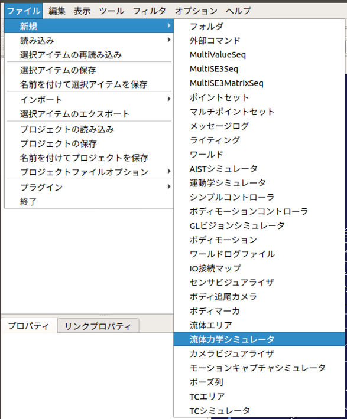

ROV／UAVのシミュレーション
==========================

ここでは、流体力学シミュレータを使った水中遊泳ロボット（ROV）と無人航空機（UAV）のシミュレートの仕方を説明します。

お知らせ
--------

2022年3月22日の更新で、プラグイン名を変更しました。
（旧）FluidDynamicsPlugin　→　（新）CFDPlugin

これに伴い、更新前のバージョンで作成されたプロジェクト（*.cnoid）の読み込みができなくなります。
つきましては、下記のとおりファイルを修正してください。

流体力学シミュレータの修正）

plugin: FluidDynamics →　plugin: CFD

class: FluidDynamicsSimulatorItem →　class: CFDSimulatorItem

流体領域アイテムの修正）

plugin: FluidDynamics →　plugin: CFD

流体力学シミュレータの作成と設定
--------------------------------

ここではChoreonoidの標準のシミュレータアイテムである「AISTシミュレータ」を用います。メインメニューの「ファイル」-「新規」-「流体力学シミュレータ」を選択して生成してください。生成した流体力学シミュレータは、AISTシミュレータアイテムの子アイテムとして配置します。

流体領域アイテムの作成と設定
------------------------------

流体領域アイテムは、Choreonoidのワールド内に水・空気等が存在する領域を仮想的に定義するためのアイテムです。メインメニューの「ファイル」-「新規」-「流体領域」を選択して生成してください。生成した流体領域アイテムは、ワールドアイテムの子アイテムとして配置します。以下の例では、流体領域アイテムを「Water0」〜「Water2」として3つ生成しています。このように複数の流体領域アイテムを生成することで、Choreonoidのワールド内により詳細な流体領域を設定することができます。

.. image:: images/fluid_1.png

.. note::
  | 複数の流体領域アイテムを使用する場合、各アイテムの対象範囲が重複する場合があります。重複が発生した場合は、アイテムツリービューに登録されているより下位の流体領域アイテムの設定が適用されます。

この流体アイテムはアイテムツリービューのチェックボックスを使用して表示・非表示を切り替えることができます。また、非表示の流体領域アイテムはシミュレーションの対象から除外されます。

流体領域アイテムのパラメータは以下の通りです。

.. list-table::
  :widths: 20,12,12,75
  :header-rows: 1

  * - パラメータ
    - デフォルト値
    - 単位
    - 意味
  * - 密度
    - 0.0
    - kg/m3
    - 流体の密度を指定します。
  * - 粘度
    - 0.0
    - Pa*s
    - 流体の粘度を指定します。
  * - 定常流
    - 0, 0, 0
    - N, N, N
    - 流体領域中にある物体に与える外力を指定します。
  * - 形状
    - Box
    - \-
    - 流体領域の形状を指定します。(Box/Cylinder/Sphere)
  * - サイズ
    - 1.0, 1.0, 1.0
    - m, m, m
    - 流体領域のサイズをXYZで指定します。（形状がBoxの場合のみ）
  * - 半径
    - 1.0
    - m
    - 流体領域の半径を指定します。（形状がCylinder・Sphereの場合のみ）
  * - 高さ
    - 1.0
    - m
    - 流体領域の高さを指定します。（形状がCylinderの場合のみ）
  * - 位置
    - 0, 0, 0
    - m, m, m
    - 流体領域の位置をXYZで指定します。
  * - RPY
    - 0, 0, 0
    - deg, deg, deg
    - 流体領域の向きをRoll, Pitch, Yawで指定します。
  * - 拡散色
    - 0, 0, 0
    - \-, -, -
    - 流体領域の拡散色ををRGBで指定します。
  * - 透過度
    - 0
    - \-
    - 流体領域の透過度を指定します。

ボディアイテムの設定
--------------------

流体力学シミュレータでは、ロボットの各リンクに作用する浮力・抵抗力を計算し、シミュレーションに反映します。

浮力・抵抗力の計算させるには、以下の設定をリンク毎に追記します。

.. code-block:: yaml

    density: 1000.0
    centerOfBuoyancy: [ 0.0, 0.0, 0.0 ]
    cdw: 1.0
    cda: 1.0
    tw: 0.2
    surface: [ 0.01, 0.01, 0.01, 0.01, 0.01, 0.01 ]

各キーの詳細は以下の通りです。

.. list-table::
  :widths: 20,16,12,75
  :header-rows: 1

  * - パラメータ
    - デフォルト値
    - 単位
    - 意味
  * - density
    - 0.0
    - kg/m3
    - リンクの密度を指定します。
  * - centerOfBuoyancy
    - 0.0, 0.0, 0.0
    - m, m, m
    - 浮力の中心の座標を指定します。
  * - cdw
    - 0.0
    - \-
    - 水中での抗力係数を指定します。
  * - cda
    - 0.0
    - \-
    - 空気中での抗力係数を指定します。
  * - tw
    - 0.0
    - \-
    - 水中で回転運動をしている場合の抵抗力の係数を指定します。値を大きくすると回転運動を妨げるためのトルクが大きくなります。
  * - surface
    - 0.0, 0.0, 0.0, 0.0, 0.0, 0.0
    - m, m, m, m, m, m
    - 各座標軸方向から見たリンクの代表面積(X+, X-, Y+, Y-, Z+, Z-)を指定します。抗力を発生させない面がある場合は、その代表面積を0.0に設定してください。
  * - cv
    - 0.0
    - m
    - 粘性力の計算に用いる任意の係数を指定します。粘性力は本係数×リンクを包含している流体領域の粘度×リンクの速度で計算されます。

スラスタの設定
--------------

流体力学シミュレータは、ROVの動力源となるスラスタを提供します。このスラスタを通じてROVに推力とトルクを与えることができます。なおスラスタは、ボディアイテムのローカル座標系のX軸+方向を初期方向としています。

スラスタは、カメラやライト等と同様に任意のリンクのelements以下に記述します。

.. code-block:: yaml

      -
        type: Thruster
        name: Thruster
        forceOffset: 1.0
        torqueOffset: 0.1

各キーの詳細は以下の通りです。

.. list-table::
  :widths: 20,12,8,75
  :header-rows: 1

  * - パラメータ
    - デフォルト値
    - 単位
    - 意味
  * - type
    - \-
    - \-
    - デバイスの種類を指定します。
  * - name
    - \-
    - \-
    - スラスタ名を指定します。
  * - forceOffset
    - 0.0
    - N
    - スタスタの推力のオフセットを指定します。
  * - torqueOffset
    - 0.0
    - Nm
    - スタスタのトルクのオフセットを指定します。
  * - symbol
    - true
    - \-
    - スタスタの向きを表すシンボルの表示/非表示を指定します。

ロータの設定
------------

流体力学シミュレータは、UAVの動力源となるロータを提供します。このロータを通じてUAVに推力とトルクを与えることができます。なおロータは、ボディアイテムのローカル座標系のZ軸+方向を初期方向としています。

ロータは、カメラやライト等と同様に任意のリンクのelements以下に記述します。

.. code-block:: yaml

      -
        type: Rotor
        name: Rotor
        forceOffset: 1.0
        torqueOffset: 0.1

各キーの詳細は以下の通りです。

.. list-table::
  :widths: 20,12,8,75
  :header-rows: 1

  * - パラメータ
    - デフォルト値
    - 単位
    - 意味
  * - type
    - \-
    - \-
    - デバイスの種類を指定します。
  * - name
    - \-
    - \-
    - ロータ名を指定します。
  * - forceOffset
    - 0.0
    - N
    - ロータの推力のオフセットを指定します。
  * - torqueOffset
    - 0.0
    - Nm
    - ロータのトルクのオフセットを指定します。
  * - symbol
    - true
    - \-
    - ロータの向きを表すシンボルの表示/非表示を指定します。

シミュレーションの実行
----------------------

シミュレーションバーから通常通りシミュレーションを実行してください。シミュレーションに成功すると流体領域アイテムの設定に基づいた浮力・抵抗力等がシミュレーション中のロボットに反映されます。
