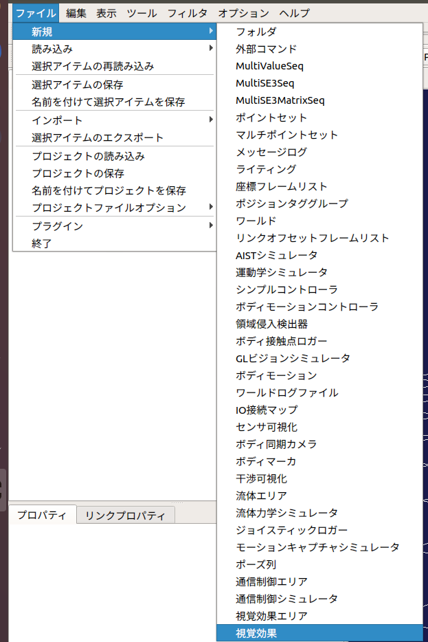

カメラ画像のシミュレーション
============================

ここでは、カメラビジュアライザを使ったカメラ画像のシミュレートの仕方を説明します。

画像ビューの生成
----------------

カメラビジュアライザアイテムによって視覚効果が付与されたカメラ画像は、「画像ビュー」に表示されます。
メインメニューの「表示」-「ビューの表示」-「画像」から画像ビューを生成してください。

.. image:: images/image_0.png

画像ビューバーの生成
--------------------

シミュレートするカメラの選択とカメラ画像に付与する効果の設定には、画像ビューバーを使用します。メインメニュー「表示」-「ツールバーの表示」-「画像ビューバー」から画像ビューバーを生成してください。

.. image:: images/image_1.png

カメラビジュアライザの作成と設定
----------------------------------

シミュレーションの実行主体となるカメラビジュアライザアイテムを生成します。

ここではChoreonoidの標準のシミュレータアイテムである「AISTシミュレータ」を用います。
メインメニューの「ファイル」-「新規」-「カメラビジュアライザ」を選択して生成してください。生成したカメラビジュアライザは、任意のホディアイテムの子アイテムとして配置します。
ボディアイテムの子アイテムにカメラビジュアライザを設定すると、シミュレートできるカメラのアイテムが自動生成されます。この自動生成されたカメラのアイテムのチェックボックスにチェックしたカメラが、画像ビューバーのコンボボックスに登録されます。
次に、メインメニューの「ファイル」-「新規」-「GLビジョンシミュレータ」を選択して生成してください。GLビジョンシミュレータはAISTシミュレータアイテムの子アイテムとして配置します。

視覚効果の設定
--------------

視覚効果には以下のダイアログを使用します。画像ビューバー右のスパナのアイコンを選択してください。

.. image:: images/image_3.png

カメラビジュアライザでは、以下の視覚効果をカメラ画像に付与することができます。

.. list-table::
  :widths: 20,12,8,75
  :header-rows: 1

  * - パラメータ
    - デフォルト値
    - 単位
    - 意味
  * - 色相
    - 0
    - \-
    - 色相を調整します。
  * - 彩度
    - 0
    - \-
    - 彩度を調整します。
  * - 明度
    - 0
    - \-
    - 明度を調整します。
  * - 赤
    - 0
    - \-
    - 赤色の輝度を調整します。
  * - 緑
    - 0
    - \-
    - 緑色の輝度を調整します。
  * - 青
    - 0
    - \-
    - 青色の輝度を調整します。
  * - 歪み
    - 0
    - \-
    - 樽型歪みの度合いを調整します。
  * - 拡大率
    - 0
    - \-
    - 拡大率を調整します。
  * - 標準偏差
    - 1
    - \-
    - ガウシアンノイズの度合いを調整します。
  * - 白色ノイズ
    - 0
    - \-
    - ゴマ塩ノイズの白色の生成確率を調整します。
  * - 黒色ノイズ
    - 0
    - \-
    - ゴマ塩ノイズの黒色の生成確率を調整します。
  * - 反転
    - false
    - \-
    - 画像の上下と左右を反転します。
  * - フィルタ
    - フィルタなし
    - \-
    - 画像に指定したフィルタを適用します。※ガウシアン（5x5）は演算負荷が大きいため表示がカクつきます。

シミュレーションの実行
----------------------

シミュレーションバーから通常通りシミュレーションを実行してください。任意の画像ビューを選択し、画像ビューバーのコンボボックスからカメラを選択するとカメラ画像が表示されます。
以下は、歪みを-0.3、拡大率を1.7とした場合のカメラ画像の例です。

.. image:: images/image_4.png

