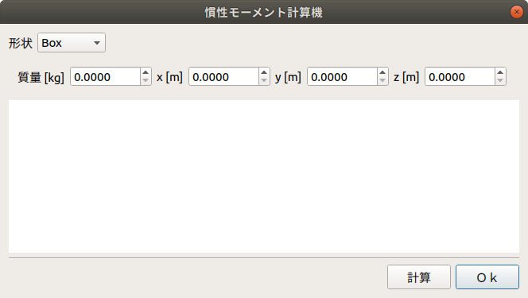

慣性モーメントの計算
====================

ここでは、慣性モーメント計算機の使い方を説明します。
この機能は、Box・Cyliner・Sphere・Coneの4つのプリミティブ形状の慣性モーメントを簡易に計算するものです。

慣性モーメント計算機の表示
--------------------------

以下の手順で慣性モーメント計算機を表示します。

1. 「メニュー」-「ツール」から「慣性モーメント計算機」を選択する。

下図は、慣性モーメント計算機のダイアログです。

計算の実行
----------

以下の手順で慣性モーメントを計算します。

1. 「形状」から慣性モーメントを計算したい形状を選択する。
2. 各パラメータを入力し、「計算」を押す。

※パラメータ「回転軸」は、CylinderまたはCone形状の中心軸の向きを表します。

