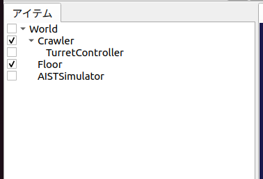
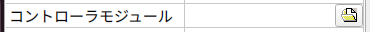

ステップ2: コントローラの作成と導入
===================================

ステップ1ではコントローラが無かったため、シミュレーションの際にCrawlerモデルのカメラ台座の姿勢を維持することができませんでした。そこでステップ2では姿勢を維持するための最小限のコントローラの作成を通して、コントローラ導入の基本を学ぶことにします。

.. contents:: 目次
   :local:
   :depth: 2

.. highlight:: C++
   :linenothreshold: 7

.. _step2-ref1:

コントローラの形式について
--------------------------

一般的に、コントローラの実装形式は様々なものがあり得ます。特定のロボットシステムやシミュレータが規定する形式もありますし、ROSなどのミドルウェアの規定する形式でコントローラを実装することも一般的となっています。

これに関して、本チュートリアルでは、Choreonoid独自の 「シンプルコントローラ（SimpleController）」の形式でコントローラの実装を行います。シンプルコントローラは、C++言語とChoreonoid内部のデータ構造を用いてコントローラを実装するもので、ROSなどのミドルウェアを使用する場合と比べて覚えることが少なくて済み、コードも比較的シンプルなものになるといった利点があります。

ただしこれはChoreonoidの独自形式であるため、汎用性の面ではROSなどのミドルウェアに劣ります。また、ROSなどのミドルウェアが提供するような通信機能を提供するものでもありません。ChoreonoidはROSと連携する機能も備えていますので、必要に応じてそちらも用いるようにしてください。ROSを利用する方法については `ROS2との連携 <https://choreonoid.org/ja/documents/latest/ros2/index.html>`_ で解説しています。

.. _step2-ref2:

コントローラ "TurretController1" の実装
---------------------------------------

シンプルコントローラ形式ではC++のクラスとしてコントローラを実装します。ここではカメラ台座(Turret)のピッチ軸を維持するだけの "TurretController1" の実装を行います。まずこのコントローラのソースコードを以下に示します。

.. _controller-example1:

.. literalinclude:: ./src/TurretController1.cpp
   :language: C++
   :linenos:
   :caption: TurretController1.cpp

以下では、このコントローラをシミュレーションプロジェクトに導入し、シミュレーションを行うまでを解説します。その後、コントローラの実装内容について解説したいと思います。

.. _step2-ref3:

コントローラのビルド方法
------------------------

C++言語で記述されたコントローラのソースコードをビルド（コンパイル）するにあたって、主に以下の２通りの方法があります。

1. Choreonoid本体と一緒にビルドを行う
2. Choreonoid本体とは別にビルドを行う

Choreonoidをソースからビルドしている場合、1の方が手軽ですので、本チュートリアルでは1で解説を進めることにします。

ビルド方法の詳細については `コントローラのビルド <https://choreonoid.org/ja/documents/latest/simulation/howto-build-controller.html>`_ で解説していますのでそちらを参照してください。実際のコントローラ開発時には、環境や目的に応じて両手法を使い分けることになるかと思います。

いずれの場合も、まずコントローラのソースコードを格納するディレクトリが必要となります。これを *「プロジェクトディレクトリ」* と呼ぶことにします。（プロジェクトディレクトリには本チュートリアルで作成する他のファイルも格納することにします。）

上記の1の方法でビルドを行う場合は、プロジェクトディレクトリをChoreonoid本体のビルドシステムに認識させる必要があります。これについても2通りの方法があります。

A. Choreonoidのソースディレクトリ内の "ext" ディレクトリに対象のディレクトリを配置する
B. ChoreonoidのCMakeの設定で "ADDITIONAL_EXT_DIRECTORIES" に対象のディレクトリを指定する

Aを採用する場合は、プロジェクトディレクトリをextディレクトリ以下に作成します。
Bを採用する場合は、プロジェクトディレクトリをどこかに作成した上で、そのディレクトリへのパスを上記の設定項目に指定します。対象ディレクトリが複数ある場合は、セミコロンで区切って入力することができます。

特に理由がなければAの方法を用いるのがよいかと思います。以下ではその方法で進めることにします。

.. _step2-ref4:

プロジェクトディレクトリの作成
------------------------------

ではプロジェクトディレクトリをext以下に作成しましょう。ディレクトリ名は何でもよいですが、ここでは "Crawler" というディレクトリ名を使うことにします。例えばChoreonoidのソースディレクトリ上で

.. code-block:: sh

 cd ext
 mkdir Crawler

などとします。

この "Crawler" ディレクトリの中に、本ステップの冒頭の :ref:`step2-ref2` で示したソースコードのファイルを作成してください。ファイル名は "TurretController1.cpp" とすることにします。

ここまで進めると、プロジェクトディレクトリとその中のファイルは以下の構成になります。

.. code-block:: text

 Choreonoidソースディレクトリ
  + ext
    + Crawler
      - TurretController1.cpp

なお、ステップ1で :ref:`step1-ref7` を行ったファイルについても、この "Crawler" ディレクトリにまとめて保存するとよいでしょう。そのように、本チュートリアルのシミュレーションプロジェクトに関わる全てのファイルをまとめておく意図もあるので、このディレクトリを「プロジェクトディレクトリ」と呼んでいます。

.. note:: Ubuntuでどのテキストエディタを使ったらよいか分からないという方は、とりあえず標準の "gedit" というテキストエディタを使ってみて下さい。アプリの検索で "gedit"と入力すると出てくる「テキストエディター」というアイコンで起動できます。コマンドラインから "gedit" と入力してもOKです。

.. note:: ソースコードのファイルはChoreonoid本体の "sample/tutorial/Crawler/" 以下に格納されています。自分で入力するのが面倒な場合は、このファイルを利用してもOKです。本チュートリアルで言及する他のファイルについてもこのディレクトリに格納されていますので、必要に応じてご利用下さい。

.. _step2-ref5:

CMakeLists.txtの記述
--------------------

次に、プロジェクトディレクトリ "Crawler" 内に "CMakeLists.txt" というテキストファイルを新たに作成し、ここにコントローラのコンパイルに関する設定を記述します。

といっても今回記述すべき内容は非常にシンプルで、新規作成した "CMakeLists.txt" のファイルに以下の一行を記述すればOKです。

.. cmake-example1:

.. literalinclude:: ./src/CMakeLists.txt
   :language: YAML
   :linenos:
   :caption: CMakeLists.txt
   :lines: 1
   :lineno-start: 1

ここで用いている "choreonoid_add_simple_controller" という関数は、Choreonoid本体のCMake記述にて予め定義された関数です。この関数に、生成されるコントローラの名前とソースファイルを与えるだけで、コントローラのコンパイルを行うことができます。

今回コントローラ名に "CrawlerTutorial" というプレフィックスをつけています。これは必須というわけではありませんが、今後他のプロジェクトで開発したコントローラと区別しやすくするためにつけています。

ここまで進めると、プロジェクトディレクトリとその中のファイルは以下の構成になります。

.. code-block:: text

 Choreonoidソースディレクトリ
  + ext
    + Crawler
      - CMakeLists.txt
      - TurretController1.cpp

.. _step2-ref6:

コントローラのビルド
--------------------

.. highlight:: sh

コントローラのビルドを行いましょう。今回はChoreonoid本体と一緒にビルドする手法を用いているので、再度Choreonoid本体のビルドを行えばOKです。今回CMakeLists.txtが追加されましたので、まずそれを認識させるため、CMakeを再実行しましょう。ステップ1で開いた端末についてはChoreonoid本体のソースディレクトリがカレントディレクトリになっているかと思います。そうでない場合は ::

 cd [Choreonoid本体のソースディレクトリへのパス]

として、Choreonoid本体のソースディレクトリに移動してください。

通常はビルド用の "build" ディレクトリを作成してビルドしているかと思いますので、そちらに移動して、CMakeを再実行します。 ::

 cd build
 cmake ..

つぎにビルドディレクトリ上で続けて ::

 make

と入力して下さい。（ビルド方法の詳細は `ソースコードからのビルドとインストール (Ubuntu Linux編) <https://choreonoid.org/ja/documents/latest/install/build-ubuntu.html>`_ の `Choreonoidのビルド <https://choreonoid.org/ja/documents/latest/install/build-ubuntu.html#install-build-ubuntu-build>`_ を参照して下さい。）

この際 :ref:`step2-ref3` で述べたAかBの条件を満たしていれば、上記のCMakeLists.txtが検出され、その内容も実行されるというわけです。

ビルドに成功すると、ビルドディレクトリの "lib/choreonoid-x.x/simplecontroller" （x.xはChoreonoidのバージョン番号）に、

* **CrawlerTutorial_TurretController1.so**

というファイルが生成されるはずです。これがコントローラ本体のファイルとなります。この拡張子からも分かるように、コントローラの実態は共有ライブラリファイルとなります。コントローラが生成されたディレクトリは今後 *「コントローラディレクトリ」* と呼ぶことにします。

コンパイルエラーが出た場合は、エラーメッセージを参考にして、ソースコードやCMakeLists.txtの記述を見直してみて下さい。

.. note:: この後 "make install" を実行すると、生成されたコントローラのファイルである "CrawlerTutorial_TurretController1.so" もインストール先にコピーされます。ただし本チュートリアルでは、ステップ1の :ref:`step1-ref1` で述べたように、"make install" は実行せずに、buildディレクトリ内のファイルを実行する前提で解説していますので、その点にご注意ください。

.. _step2-ref7:

コントローラの導入
--------------------

ビルドしたコントローラをシミュレーションプロジェクトに導入します。

コントローラアイテムの生成
~~~~~~~~~~~~~~~~~~~~~~~~~~

シンプルコントローラは「シンプルコントローラアイテム」によってプロジェクトに導入するようになっていますので、まずは対応するアイテムを生成しましょう。メインメニューの「ファイル」-「新規」から「シンプルコントローラ」を選択して生成します。アイテムの名前はなんでもよいですが、コントローラに合わせて "TurretController" とするとよいでしょう。

生成したアイテムは、下図のように、制御対象のCrawlerアイテムの子アイテムとして配置するようにします。

この配置によって、コントローラの制御対象がCrawlerモデルであることを明示します。これを実現するにあたっては、Crawlerアイテムを選択状態としてからコントローラアイテムの生成を行ってもよいですし、生成後にこの配置になるようドラッグしてもOKです。

コントローラ本体のセット
~~~~~~~~~~~~~~~~~~~~~~~~

次に先ほど作成したコントローラの本体をシンプルコントローラアイテムにセットします。

これはシンプルコントローラアイテムの「コントローラモジュール」というプロパティを用いて行います。まず、アイテムツリー上で "TurretController" を選択します。するとこのアイテムのプロパティ一覧がアイテムプロパティビュー上に表示されますので、その中から「コントローラモジュール」というプロパティを探して下さい。そのプロパティの値の部分（デフォルトでは空欄となっている）をダブルクリックすると、モジュールのファイルを入力することができます。

この際、入力用のファイルダイアログを用いて入力するのが手軽です。コントローラモジュールの入力時には下図に示すように値を入力する箇所の右端にアイコンがあります。

このアイコンをクリックすると、ファイル選択のダイアログが表示されます。このダイアログは通常シンプルコントローラ格納用の標準ディレクトリを指しています。そこには先ほど作成した "CrawlerTutorial_TurretController1.so" が格納されているはずですので、これを選択して下さい。

これでコントローラ本体がシンプルコントローラアイテムにセットされました。これでコントローラを機能させることができます。

ここまで設定できたら、またプロジェクトを保存しておきましょう。ファイル名は "step2.cnoid" として、プロジェクトディレクトリに保存しておくとよいかと思います。

.. _step2-ref8:

シミュレーションの実行
----------------------

以上の設定を行った上でシミュレーションを実行して下さい。すると、ステップ1では重力で下を向いてしまったカメラ台座が、今回は正面を向いたままとなっているはずです。これはコントローラ "TurretController1" によって、姿勢の維持に必要なトルクがカメラ台座ピッチ軸にかけられているからです。

うまくいかない場合は、メッセージビューも確認してみて下さい。コントローラの設定や稼働に問題があると、シミュレーション開始時にその旨を知らせるメッセージが出力される場合があります。

なお、このコントローラではカメラ台座ヨー軸の制御は行っていないため、そちらには力がかかっていません。ステップ1の時と同様に、 `インタラクション機能 <https://choreonoid.org/ja/documents/latest/simulation/interaction.html>`_ を用いてカメラ台座部分をドラッグすると、ヨー軸に関してはフリーで動かせることが分かります。

.. _step2-ref9:

実装内容の解説
--------------

今回作成したコントローラ "TurretController1" の実装内容は以下のようになっています。

SimpleControllerクラス
~~~~~~~~~~~~~~~~~~~~~~

まず、シンプルコントローラはChoreonoidで定義されている "SimpleController" クラスを継承したクラスとして実装するようになっています。そこでまず ::

 #include <cnoid/SimpleController>

によって、このクラスが定義されているヘッダをインクルードしています。Choreonoidが提供するヘッダファイルはインクルードディレクトリの "cnoid" サブディレクトリに格納されるようになっており、このように cnoid ディレクトリからのパスとして記述します。拡張子は必要ありません。

また、Choreonoidで定義されているクラスは全て "cnoid" という名前空間に所属しています。ここでは ::

 using namespace cnoid;

によって名前区間を省略できるようにしています。

コントローラのクラス定義は、 ::

 class TurretController1 : public SimpleController
 {
     ...
 };

によって行われています。SimpleControllerを継承するかたちでTurretController1を定義していることが分かります。

SimpleControllerクラスではいくつかの関数が仮想（バーチャル）関数として定義されており、継承先でそれらの関数をオーバーライドすることでコントローラの処理内容を実装します。通常以下の２つの関数をオーバーライドします。

* **virtual bool initialize(SimpleControllerIO* io)**
* **virtual bool control()**

initialize関数の実装
~~~~~~~~~~~~~~~~~~~~

initialize関数はコントローラの初期化を行う関数で、シミュレーション開始の直前に１回だけ実行されます。

この関数に引数として与えられるSimpleControllerIO型は、コントローラの入出力に必要な機能をまとめたクラスとなっています。この詳細は `コントローラの実装 <https://choreonoid.org/ja/documents/latest/simulation/howto-implement-controller.html>`_ の `IOオブジェクト <https://choreonoid.org/ja/documents/latest/simulation/howto-implement-controller.html#simulator-simple-controller-io>`_ をみていただくとして、ここではまず ::

 joint = io->body()->link("TURRET_P");

によって、カメラ台座ピッチ軸の入出力を行うためのLinkオブジェクトを取得し、joint変数に格納しています。

io->body() によってCrawlerモデル入出力用のBodyオブジェクトを取得し、続けてこのオブジェクトが有するLinkオブジェクトから "TURRET_P" という名前を持つものを取得しています。これは :doc:`step0` において記述した :ref:`tutorial-20` の関節に対応するものです。

次に ::

 joint->setActuationMode(Link::JointEffort);

によって、この関節の `状態変数シンボル <https://choreonoid.org/ja/documents/latest/simulation/howto-implement-controller.html#simulation-implement-controller-actuation-mode>`_ を関節トルクに設定しています。これにより、関節トルクを指令値とした制御が可能となります。

また、 ::

 io->enableIO(joint);

によって、この関節に対する入出力を有効にしています。この記述は関節のデフォルトの入出力を有効化するものです。今回悪チュエーションモードが関節トルクとなっているので、関節角度を入力し、関節トルクを出力することになります。これによってこの関節に対してPD制御を行うことが可能となります。

関節に対して上記のアクチュエーションモードの設定や入出力の有効化を行わない場合、その関節の制御を行うことはできませんので、ご注意下さい。入出力を設定する関数としては、他に入力飲みを設定する enableInput という関数と、出力のみを設定する enableOutput という関数も利用可能です。

.. note:: 同様のことを行う関数として、SimpleControllerIOのsetLinkInput、setJointInput、setLinkOutput、setJointOutputといった関数もありますが、これらは古い仕様の関数を互換性のために残しているものですので、今後はenableXXXの関数を使うようにしてください。

他にPD制御に必要な値として、 ::

 q_ref = q_prev = joint->q();

によって初期関節角度を取得し、それを変数q_ref、 q_prevに代入しています。q_refは目標関節角で、q_prevは関節角速度計算用の変数です。また、 ::

 dt = io->timeStep();

によって変数dtにタイムステップを代入しています。これはシミュレーションの物理計算１回あたりに進める内部の時間を表していて、この時間間隔で次の control 関数が呼ばれることになります。

最後にinitialize関数の戻り値として true を返して、初期化に成功したことをシステムに伝えています。

control関数の実装
~~~~~~~~~~~~~~~~~

control関数は実際の制御コードを記述する部分で、シミュレーション中に繰り返し実行されます。

ここではカメラ台座ピッチ軸に関するPD制御のコードが書かれているだけです。 ::

 static const double P = 200.0;
 static const double D = 50.0;

はPゲイン、Dゲインの値で、 ::

 double q = joint->q(); // input

によって現在関節角を入力し、 ::

 double dq = (q - q_prev) / dt;

によって現在角速度を算出し、 ::

 double dq_ref = 0.0;

で目標角速度は0に設定し、 ::

 joint->u() = P * (q_ref - q) + D * (dq_ref - dq); // output

によってPD制御で計算したトルク値を関節に出力し、 ::

 q_prev = q;

によって次回計算用にq_prevを更新しています。

このように、入出力はLinkオブジェクトの変数を用いて行うことがポイントです。joint->q()、joint->u() はそれぞれ関節角度、関節トルクの変数に対応しています。

最後に、正常終了を表すtrueを戻り値として返しています。これによって制御ループが継続されます。

ファクトリ関数の定義
~~~~~~~~~~~~~~~~~~~~

シンプルコントローラのクラスを定義したら、そのオブジェクトを生成する「ファクトリ関数」も所定の形式で定義しておく必要があります。これは、シンプルコントローラアイテムが実行時にコントローラの共有ライブラリを読み込んで、そこからコントローラのオブジェクトを生成するために必要となります。

これはマクロを使って、 ::

 CNOID_IMPLEMENT_SIMPLE_CONTROLLER_FACTORY(TurretController1)

と記述することができます。引数としてはこのようにコントローラのクラス名を与えて下さい。
