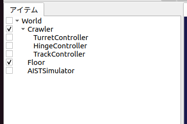
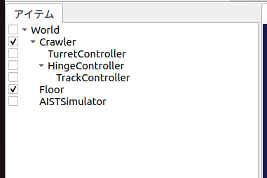

ステップ5: クローラの制御
=========================

ステップ3でカメラ台座の制御ができるようになりましたので、ステップ5では車体を動かすクローラ部分の制御をできるようにしましょう。

.. contents:: 目次
   :local:
   :depth: 2

.. highlight:: C++
   :linenothreshold: 7

.. _step5-ref1:

Crawlerモデルの簡易クローラ
---------------------------

Crawlerモデルの左右のクローラは「簡易クローラ」としてモデリングされています（ `クローラの記述 <https://choreonoid.org/ja/documents/latest/handling-models/modelfile/modelfile-newformat.html#modelfile-yaml-crawlers>`_ 参照）。これはクローラ部と環境との接触点に推力を与えるというもので、履帯の部分が実際にホイールの周りを動いていくというものではないのですが、これを用いることでクローラ風の動きをすることが可能です。ただし、履帯の部分が地形に沿って変形していくようなものではないので、走破性は本物のクローラには及びません。この詳細は `無限軌道の簡易シミュレーション <https://choreonoid.org/ja/documents/latest/simulation/pseudo-continuous-track.html>`_ を参照して下さい。

Crawlerモデルでは、左クローラに対応するリンクが "TRACK_L"、右クローラに対応するリンクが "TRACK_R" という名前でモデリングされています。これらのリンクは簡易クローラに対応する "pseudoContinuousTrack" タイプの軸が設定されており、それらの軸をゲームパッドで制御できるようにしたいと思います。

.. _step5-ref2:

簡易クローラのコントローラ
--------------------------

今回作成するコントローラ "TrackController1" のソースコードを以下に示します。

.. _controller-example3:

.. literalinclude:: ./src/TrackController1.cpp
   :language: C++
   :linenos:
   :caption: TrackController1.cpp

これまでと同様に、上記のソースコードを "TrackController1.cpp" というファイル名でプロジェクトディレクトリに保存し、同ディレクトリ内のCMakeLists.txtに

.. cmake-example3:

.. literalinclude:: ./src/CMakeLists.txt
   :language: YAML
   :linenos:
   :caption: CMakeLists.txt
   :lines: 4
   :lineno-start: 4

という記述を追加し、コンパイルを行って下さい。

.. _step5-ref3:

コントローラの導入
------------------

コントローラの導入についても、これまでと同様に…と言いたいところですが、今回作成したコントローラはカメラ台座を制御する部分がありませんので、このコントローラだけセットしても、カメラ台座を動かすことができなくなってしまいます。そこで、これまでのカメラ台座のコントローラを生かしつつ、今回のコントローラを追加で導入したいと思います。

.. note:: もちろん、今回のソースコード自体にカメラ台座制御のコードも含めておくという手もあります。その場合はこれまでと同様に、シンプルコントローラアイテムの「コントローラモジュール」に、統合したコントローラのファイルを指定すればOKです。本チュートリアルではステップごとに追加される部分を明確にするため、各ステップのコントローラにはあえて追加部分のみを記述しています。また、そのようにコントローラを機能ごとに分けておくことは、開発したコントローラの再利用性を向上させることにもつながります。

コントローラを追加するには、シンプルコントローラアイテムを追加すればOKです。ステップ2で行った `コントローラアイテムの生成 <https://choreonoid.org/ja/documents/latest/simulation/tank-tutorial/step2.html#simulation-tank-tutorial-create-controller-item>`_ と同様の操作でアイテムを生成して下さい。生成するアイテムの名前はコントローラの名前と合わせて、"TrackController" とするとよいでしょう。生成したアイテムの「コントローラモジュール」プロパティには、今回作成したコントローラファイル "CrawlerTutorial_TrackController.so" を指定します。

ここで注意が必要なのが、追加したコントローラアイテムの配置です。まず、ひとつ目のコントローラアイテムと同様に、以下のように配置することが考えられます。

このように制御対象モデルの子アイテムとして複数のコントローラアイテムを並列に配置した場合、それらは独立したコントローラとしてモデルの制御を行います。具体的には以下の動作となります。

* 各コントローラに渡される SimpleControllerIO型のオブジェクト(IOオブジェクト）はそれぞれ異なるオブジェクトとなる。IOオブジェクトから取得する入出力用Bodyオブジェクトについても異なるものとなる。

* 各コントローラのcontrol関数は並列に実行される。正確には、シミュレータアイテムの「コントローラスレッド」プロパティがtrueとなっている場合、各コントローラのcontrol関数用に別スレッドが割り当てられて、それらが並列実行される。

一方で、今回の2つのコントローラアイテムは以下のように配置することも可能です。

ここでは2つ目のコントローラを１つめのコントローラの子アイテムとして配置しています。この場合、２つのコントローラが一体となって動作します。具体的には以下の動作となります。

* 各コントローラに渡されるIOオブジェクトは、同一オブジェクトの共有となる。従って、IOオブジェクトから得られる入出力用Bodyオブジェクトも共有となる。

* 各コントローラのcontrol関数は直列に実行される。実行順序はツリー内での深さ優先探索順となる。

本チュートリアルで作成するコントローラはどちらの場合でも正常に動作しますが、一般的には後者の一体形式を用いるのが望ましいです。そちらの方が必要なリソースが少なくて済みますし、コントローラ間の連携もしやすくなるからです。本チュートリアルではこの一体形式を用いるものとしますので、本ステップでは２番目の図のようにTurnetControllerの子アイテムとしてTrackControllerを配置するようにしてください。

なお、前者の並列形式についても、複数のコントローラの並列実行が可能という点は利点となります。また、異なるタイプのコントローラアイテムは、この形式でしか利用できません。従って、状況に応じて両形式を使い分けることになります。

ここまで設定できたら、またプロジェクトを保存しておきましょう。ファイル名は "step5.cnoid" として、プロジェクトディレクトリに保存しておくとよいかと思います。

.. _step5-ref4:

クローラの操作
--------------

シミュレーションを実行しましょう。今回はゲームパッドのもう一方（左側）のアナログスティックで、Crawlerモデルの車体を走らせることができますので、試してみて下さい。スティックを前に倒すと前進、後ろで後退、左で左旋回、右で右旋回となります。

また、TurretControllerも残してありますので、カメラ台座の制御も引き続き可能となっています。

ゲームパッドの各部位と操作内容の対応を仮想ジョイスティックビューで示すと以下のようになります。

.. image:: images/step3-1.png

これでCrawlerモデルの全ての軸を操作できるようになりました。

.. _step5-ref5:

実装内容の解説
--------------

TrackController1の実装内容について、このコントローラに特有の部分に絞って解説します。

まずintialize関数内の ::

 trackL = io->body()->link("TRACK_L");
 trackR = io->body()->link("TRACK_R");

によって、左右それぞれのクローラに対応する入出力用リンクを取得しています。次に ::

 trackL->setActuationMode(Link::JointVelocity);
 trackR->setActuationMode(Link::JointVelocity);

によって、各クローラリンクの `状態変数シンボル <https://choreonoid.org/ja/documents/latest/simulation/howto-implement-controller.html#simulation-implement-controller-actuation-mode>`_ として JointVelocity を指定しています。

そして、 ::

 io->enableOutput(trackL);
 io->enableOutput(trackR);

によって各クローラリンクへの出力を有効にしています。

アクチュエーションモードが JointVelocity の場合、出力する指令値はトルクではなく、クローラの表面速度で与えるようになっています。また、入力については特に必要ありません。従って、ここでは出力のみを有効化する "enableOutput" 関数を用いています。JointVelocityの場合、リンクの状態変数 dq を用いて表面速度を出力します。

control関数内の ::

 static const int axisID[] = { 0, 1 };

は、クローラ軸に対応させるゲームパッドの軸IDの設定です。これについても、 ゲームパッドの準備で述べたもの以外のゲームパッドを用いる場合は、適切な対応となるよう値を修正する必要があるかもしれません。

出力は関節速度を格納する変数dqにセットします。control関数内の ::

 trackL->dq_target() = -2.0 * pos[1] + pos[0];
 trackR->dq_target() = -2.0 * pos[1] - pos[0];

によって、軸の状態から各クローラの駆動速度を決定し出力しています。スティックの前後軸については両クローラに対して同じ駆動速度を与え、スティックの左右軸については両クローラに正反対の駆動速度を与えます。このようにすると、前後軸で前進後退、左右軸で旋回という挙動になります。
