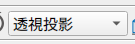
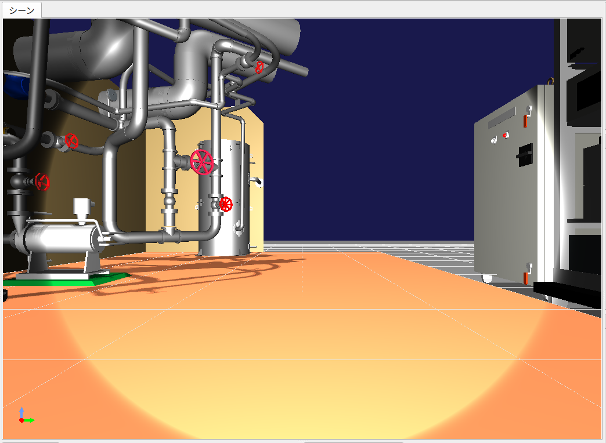
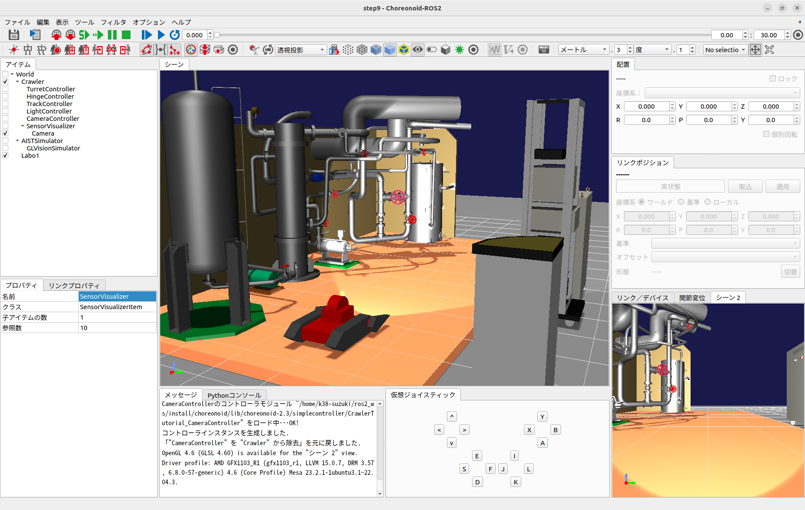

ステップ8: カメラ画像のシミュレーションと取得
=============================================

Crawlerモデルはカメラも搭載しています。ステップ8ではこのカメラをシミュレーションできるようにし、コントローラ側からカメラ画像を取得する方法を学びます。

.. contents:: 目次
   :local:
   :depth: 2

.. highlight:: C++
   :linenothreshold: 7

ステップ7で作成したプロジェクトは視覚的に様々な要素が入っていますので、本ステップはこのプロジェクトで設定した状態から進めていきましょう。まずはプロジェクトを"step8.cnoid"という名前であらためて保存し、本ステップの作業を行っていくことにします。

.. _step8-ref1:

カメラデバイス
--------------

ステップ7で扱ったライトと同様に、カメラもChoreonoid上では「デバイス」のひとつとして定義されています。Crawlerモデルが搭載しているカメラは"Camera"という名前がつけられており、この名前でデバイスを識別することができます。コントローラからのアクセス方法はライトを含む他のデバイスと同様です。

モデルファイル上でカメラが実際にどのように定義されているかは、 `カメラの記述 <https://choreonoid.org/ja/documents/latest/handling-models/modelfile/modelfile-newformat.html#modelfile-tank-camera>`_ を参照してください。

.. _step8-ref2:

シーンビューにおけるカメラの変更
--------------------------------

シーンビューは、ロボットモデルに搭載されたカメラからの視点で表示することも可能となっています。この機能を用いて、まずはCrawlerモデルに搭載されているカメラからどのような画像が得られるかを確認してみることにしましょう。

カメラの切り替えは、以下のシーンバーの「カメラの選択」コンボボックスで行うことができます。

ここをクリックすると、システムで定義されたカメラやシーンに表示されているモデルに含まれるカメラが一覧で表示されます。現在のプロジェクトの状態においては、以下が選択肢として表示されるかと思います。

* Camera - Crawler
* 透視投影
* 平行投影

"透視投影" と "平行投影" はシーンビューが標準で備えているカメラで、ユーザのマウス操作により視点を変更できるものです。それぞれ透視投影による描画、正射影による描画を行うカメラとなっていて、デフォルトは透視投影が選択されています。

"Camere - Crawler"とあるのは、Crawlerモデルに搭載されている"Camera"という名前のカメラです。今回このカメラの視点でシーンを表示させたいので、これを選択しましょう。すると、Crawlerモデルが向いている方向やシーンビューの描画設定にもよりますが、以下のような画像がシーンビュー上に表示されるかと思います。

この状態でシミュレーションを開始し、ゲームパッドでCrawlerモデルを操作してみてください。するとCrawlerの移動やカメラ台座の動きと連動して画像が動いていくかと思います。これがCrawlerモデル搭載カメラからの映像になります。

なお、シミュレーションにおいては、このようなカメラ画像と、元々のシーンビューの表示である俯瞰的な画像を、両方同時に表示したいこともあります。Choreonoidではシーンビューを追加表示することによりこれが可能ですので、試してみましょう。

メインメニューの「表示」-「ビューの生成」から、「シーン」を選択します。すると「シーンビューの生成」というダイアログが表示されます。ここでは追加するビューの名前を設定できますが、特に指定したい名前がなければデフォルトのものでもかまいません。ここで「生成」ボタンを押すと、追加のシーンビューが生成され、メインウィンドウ上に配置されます。

ビューが生成される場所はビューの種類ごとに決まっており、今回は恐らく元々シーンビューが表示されていた領域に覆いかぶさるように追加のシーンビューが表示されるかと思います。これについてはタブを操作することで、元のビューに切り替えることができますが、これでは同時表示にはなりません。同時表示するためには、 `ビューの移動 <https://choreonoid.org/ja/documents/latest/basics/mainwindow.html#basics-view-move>`_ 操作を行って、追加のビューをメインウィンドウ上の別の領域に移動させます。

ビューの移動ができたら、描画に使用するカメラも切り替えておきましょう。各シーンビューのカメラはそれぞれ独立に切り替えることができます。この場合、シーンバーの操作は最後にフォーカスの入ったシーンビューに対して適用されますので、まずは元からあるシーンビューの領域をマウスでクリックするなどしてフォーカスを入れた後、シーンバーのカメラ選択コンボで "透視投影" を選択します。次に追加したシーンビューに対して同様にフォーカスを入れ、カメラ選択コンボで "Camera - Crawler" を選択します。それぞれのビューの位置やサイズについても調整して見やすくしましょう。このような操作により、以下のような表示を行うことができます。

ここでは、追加したシーンビューを右下に配置し、そこにはCrawlerモデルのカメラ画像を表示し、中央のシーンビューにはデフォルトのカメラによる俯瞰表示を行っています。

.. _step8-ref3:

カメラ画像のシミュレーション
----------------------------

シーンビューを用いてカメラ画像を表示することができました。ただしこれはGUI上での描画を行うものであり、シミュレーションとは独立した機能となっています。実際シミュレーションを開始していなくても、カメラ画像の描画は行えているのが分かるかと思います。シミュレーションにおいてコントローラからカメラ画像を取得するためには、デバイスとしてのカメラ画像のシミュレーションも行う必要があります。

これを行うためには、「GLビジョンシミュレータアイテム」と「センサビジュアライザ」をプロジェクトに導入する必要があります。メインメニューの「ファイル」-「新規」-「GLビジョンシミュレータ」によってこのアイテムを生成し、シミュレータアイテムの子アイテムとして配置してください。センサビジュアライザは、メインメニューの「ファイル」-「新規」-「センサ可視化」によってこのアイテムを生成し、Crawlerの子アイテムとして配置してください。また、センサビジュアライザを展開して、Cameraにチェックを入れてください。これにより、アイテムの構成は以下のようになります。

.. image:: images/step8-4.png

この状態でシミュレーションを実行すると、シミュレータの内部でカメラ画像がシミュレートされるようになり、コントローラからの取得も可能となります。

GLビジョンシミュレータアイテムの詳細は `視覚センサのシミュレーション <https://choreonoid.org/ja/documents/latest/simulation/vision-simulation.html>`_ で解説していますので、そちらも参考にしてください。

.. _step8-ref4:

コントローラのソースコード
--------------------------

GLビジョンシミュレータアイテムの導入によりカメラ画像をシミュレートできるようになりましたが、それを確認するにはカメラデバイスから画像を取得するためのコントローラが必要です。ここではそのためのコントローラとして、取得した画像をファイルに出力するというコントローラを作成します。以下にそのソースコードを示します。

.. _controller-example5:

.. literalinclude:: ./src/CameraController.cpp
   :language: C++
   :caption: CameraController.cpp

これまでと同様に、上記ソースコードを "CameraController.cpp" というファイル名でプロジェクトディレクトリに保存します。

CMakeLists.txt に

.. cmake-example3:

.. literalinclude:: ./src/CMakeLists.txt
   :language: YAML
   :caption: CMakeLists.txt
   :lines: 7

を追加して、コンパイルを行って下さい。

.. _step8-ref5:

コントローラの導入
------------------

これまでと同様に、作成したコントローラをシンプルコントローラアイテムを用いてプロジェクトに導入し、TurretControllerの子アイテムとして配置します。これにより、アイテムツリービューは以下のようになります。

.. image:: images/step8-5.png

.. _step8-ref6:

カメラ画像の取得と表示
----------------------

ではシミュレーションを実行しましょう。

Cameraコントローラの機能として、ゲームパッドもしくは仮想ジョイスティックビューのBボタン（プレイステーション用ゲームパッドの場合は○ボタン）を押すと、現在のカメラ画像がファイルに保存されます。この際メッセージビュー上に ::

 The image of Camera has been saved to "Camera.png".

と表示されます。ファイルの保存先はカレントディレクトリで、ファイル名は "Camera.png" となります。

ボタンを押してみて、保存された画像ファイルを適当な画像ビューアで表示してみてください。Ubuntu上では標準の"eog"という画像ビューアがあり、コマンドライン上で ::

 eog Camera.png

などとすることにより、取得したカメラ画像を表示できます。

eogには、読み込んだ画像ファイルが更新されるとそれに伴って表示も更新する機能があるようです。これにより、eogを表示したままにしておけば、新たな画像を取得する度に、取得した画像が更新されているのを確認できます。

.. _step8-ref7:

実装内容の解説
--------------

ステップ5のライトと同様に、initialize関数の ::

 camera = io->body()->findDevice<Camera>("Camera");

によってCameraに対応するデバイスオブジェクトを取得し、これをcamera変数に格納しています。

また、 ::

 io->enableInput(camera);

によって、このデバイスからの入力を有効化しています。デバイスからの入力を行う場合は、この記述が必要となります。

.. note:: デバイスからの出力については、step7で解説したように、デバイスに対して "notifyStateChange()" を実行することで行います。このため、enableOutput() のような関数はデバイスに対しては用意されていませんので、ご注意ください。

control関数ではBボタンの状態をチェックし、Bボタンが押されたらその時のCameraデバイスの画像をファイルに保存するという処理をしています。この処理では、まず ::

 const Image& image = camera->constImage();

によってCameraデバイスが有するImage型の画像データを取得しています。これが空でなければ、 ::

 camera->constImage().save(filename);

によって、画像をそのままファイルに保存しています。

実際のコントローラでは、この画像データに対して、画像認識の処理を行ったり、取得した画像を遠隔操作端末に送ったりといった処理を行うことになるかと思います。
