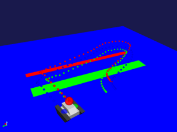

ロボットの移動経路の記録・表示
==============================

ここでは、モーションキャプチャを使ったロボットの移動経路の記録・表示の仕方と干渉の記録の仕方を説明します。

モーションキャプチャアイテムの作成と設定
----------------------------------------------------

シミュレーションの実行主体となるモーションキャプチャアイテムを生成します。
メインメニューの「ファイル」-「新規」-「モーションキャプチャ」を選択して生成してください。生成したモーションキャプチャアイテムは、対象とするボディの子アイテムとして配置します。

パッシブマーカの設定
--------------------

モーションキャプチャでは、ロボットの移動経路の代表点としてパッシブマーカを使用します。パッシブマーカは、カメラやライト等と同様に任意のリンクのelements以下に記述します。

.. code-block:: yaml

      -
        type: PassiveMarker
        name: RedMarker
        translation: [ 0.0, 0.0, 0.3 ]
        rotation: [ 0, 1, 0, -90 ]
        radius: 0.1
        color: [ 1.0, 0.0, 0.0 ]
        transparency: 0.3

各キーの詳細は以下の通りです。

.. list-table::
  :widths: 20,12,8,75
  :header-rows: 1

  * - パラメータ
    - デフォルト値
    - 単位
    - 意味
  * - radius
    - 1.0
    - m
    - パッシブマーカのマーカの半径を指定します。
  * - color
    - 1.0, 0.0, 0.0
    - \-, -, -
    - パッシブマーカのマーカの色をRGBで指定します。
  * - transparency
    - 0.0
    - \-
    - パッシブマーカのマーカの透過度を指定します。
  * - symbol
    - true
    - \-
    - パッシブマーカを表すシンボルの表示/非表示を指定します。

シミュレーションの実行
----------------------

シミュレーションバーから通常通りシミュレーションを実行してください。シミュレーションに終了するとシーンビュー内にパッシブマーカの移動経路が表示されます。また、移動経路はポイントセットアイテムとして記録され、モーションキャプチャアイテムの子アイテムとしてアイテムツリービューに登録されます。ポイントセットアイテムのチェックボタンを押すことで、移動経路の表示・非表示を切り替えることができます。記録した移動経路は、ホームディレクトリの“ダウンロード”以下にパッシブマーカ毎に格納されています。

干渉のファイル出力
------------------

以下の手順で記録した干渉をファイル出力します。

1. シミュレーション実行後に自動生成されたアイテム「Collision-<date>」を選択する。<date>は日時のサフィックスです。
2. 「メニュー」-「ファイル」から「選択したアイテムのエクスポート」を選択する。
3. 表示されるダイアログにファイル名を入力し、「保存」ボタンを押す。

干渉のグラフ表示
----------------

以下の手順で記録した干渉をグラフ表示できます。

1. 「メニュー」-「表示」-「ビューの表示」から「Multi Value Seq」を選択する。
2. グラフ表示を行うアイテム「Collision-<date>」を選択する。
3. Multi Value Seqビューの左側に表示されている数字（jointId）を選択する。
