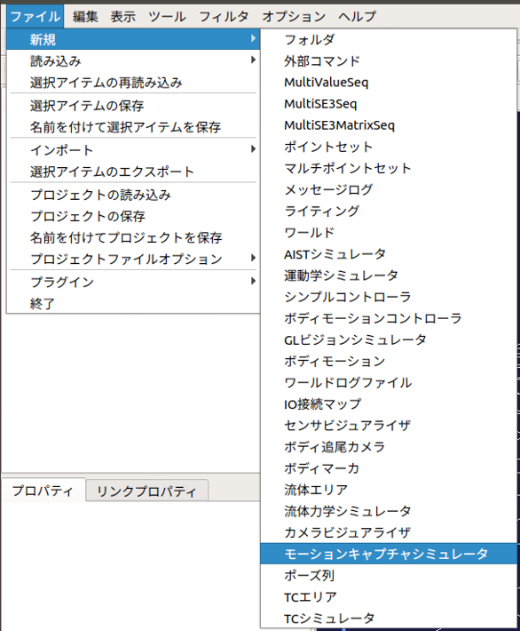
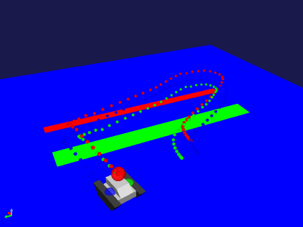

ロボットの移動経路の記録・表示
==============================

ここでは、モーションキャプチャシミュレータを使ったロボットの移動経路の記録・表示の仕方を説明します。

モーションキャプチャシミュレータアイテムの作成と設定
----------------------------------------------------

シミュレーションの実行主体となるモーションキャプチャシミュレータアイテムを生成します。

ここでは、Choreonoidの標準のシミュレータアイテムである「AISTシミュレータ」を用います。メインメニューの「ファイル」-「新規」-「モーションキャプチャシミュレータ」を選択して生成してください。生成したモーションキャプチャシミュレータは、AISTシミュレータアイテムの小アイテムとして配置します。

また、モーションキャプチャシミュレータでは以下の設定ができます。

.. list-table::
  :widths: 20,12,8,75
  :header-rows: 1

  * - パラメータ
    - デフォルト値
    - 単位
    - 意味
  * - 記録
    - true
    - \-
    - シミュレーション中の移動経路を表示・記録します。
  * - 記録間隔
    - 0.10
    - s
    - 移動経路の記録する時間間隔を指定します。
  * - CSV出力
    - false
    - \-
    - VICON社製NEXUSが出力するCSV形式で移動経路をファイル出力します。

パッシブマーカの設定
--------------------

モーションキャプチャシミュレータでは、ロボットの移動経路の代表点としてパッシブマーカを使用します。このパッシブマーカの移動経路がモーションキャプチャシミュレータアイテムのプロパティで指定した記録間隔ごとにシーンビュー内に打点されます。

パッシブマーカは、カメラやライト等と同様に任意のリンクのelements以下に記述します。

.. code-block:: yaml

      -
        type: PassiveMarker
        name: RedMarker
        translation: [ 0.0, 0.0, 0.3 ]
        rotation: [ 0, 1, 0, -90 ]
        radius: 0.1
        color: [ 1.0, 0.0, 0.0 ]
        transparency: 0.3

各キーの詳細は以下の通りです。

.. list-table::
  :widths: 20,12,8,75
  :header-rows: 1

  * - パラメータ
    - デフォルト値
    - 単位
    - 意味
  * - radius
    - 1.0
    - m
    - パッシブマーカのマーカの半径を指定します。
  * - color
    - 1.0, 0.0, 0.0
    - \-, -, -
    - パッシブマーカのマーカの色をRGBで指定します。
  * - transparency
    - 0.0
    - \-
    - パッシブマーカのマーカの透過度を指定します。

シミュレーションの実行
----------------------

シミュレーションバーから通常通りシミュレーションを実行してください。シミュレーションに成功するとシーンビュー内にパッシブマーカの移動経路が表示されます。また、記録した移動経路はマーカポイントアイテムとしてアイテムツリービューに登録されます。マーカポイントアイテムのチェックボタンを押すことで、移動経路の表示・非表示を切り替えることができます。

