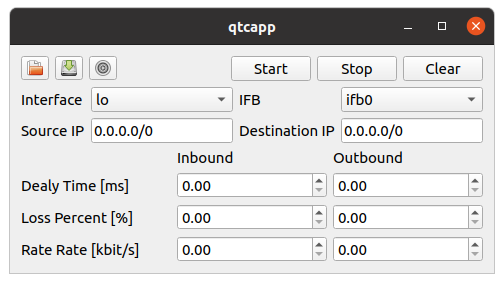

ネットワークエミュレータ(Qtcapp)の使用方法について
==================================================

Qtcappとは
----------

　Qtcappは、HAIROWorldPlugin（https://github.com/k38-suzuki/hairo-world-plugin）が提供するネットワーク通信障害を模擬するための機能を１つのアプリケーションとして動作するように改良したネットワークエミュレーションツールです。Qtcappを使用することで、遅延・帯域減少・パケットロス等が発生している通信環境を擬似的に構築することができ、ネットワーク通信を行うシステムの通信試験等に利用できます。
　
ソースコードからのビルドとインストール
--------------------------------------

ソースコードの取得
~~~~~~~~~~~~~~~~~~

Qtcappはgitリポジトリとして管理されており、githubの以下のアドレスにて公開されています。

- https://github.com/k38-suzuki/qtcapp

任意のディレクトリに移動して、以下のコマンドでQtcappを取得します。 ::

 git clone https://github.com/k38-suzuki/qtcapp.git

これによってリポジトリを格納した "qtcapp" というディレクトリが生成されます。このディレクトリ内で ::

 git pull

などとすることにより、その時点での最新のソースコードにアップデートできます。

依存パッケージのインストール
~~~~~~~~~~~~~~~~~~~~~~~~~~~~

Ubuntuの場合、"qtcapp/misc/script" 以下にある "install-requisites-ubuntu-x.x.sh" というスクリプトを用いることにより、以上のソフトウェアのほとんどを簡単にインストールすることができます。x.xはUbuntuのバージョンに対応します。例えば Ubuntu 20.04 であれば ::

 misc/script/install-requisites-ubuntu-20.04.sh

を実行すると、sudoのパスワードが求められるので入力してください。すると、パッケージシステム経由で、必要なパッケージが自動でインストールされます。

また、/etc/sudoersに以下が自動で書き込まれます。 ::

 <username>    ALL=NOPASSWD: /sbin/modprobe
 <username>    ALL=NOPASSWD: /sbin/ip
 <username>    ALL=NOPASSWD: /sbin/tc
 <username>    ALL=NOPASSWD: /sbin/rmmod

<username>は、使用しているユーザ名です。これは、Qtcapp内で利用しているルート権限を要するコマンド(modprobe, ip等)をパスワードなしで実行するための設定です。これにより、"Start"ボタン押下時にパスワードの入力が求められないようにしています。

CMake によるビルド設定
~~~~~~~~~~~~~~~~~~~~~~

まず、cmakeコマンドを使ってMakefileを更新します。Qtcappのビルドディレクトリ上で ::

 cmake .. -DUSE_CATKIN_MAKE=OFF

を実行すると、必要なライブラリをチェックしMakefileを更新します。(cmakeコマンドのあとのピリオドに注意してください。）"-DUSE_CATKIN_MAKE=OFF"は、qtcappを単体でビルドするためのビルドオプションです。

ビルド
~~~~~~

CMakeの実行に成功すると、ビルドのためのMakefile一式がビルドディレクトリ内に生成されます。ビルドディレクトリで ::

 make

を実行することで、Qtcappのビルドが行われます。

マルチコアCPUであれば、"-j" オプションにより並列ビルドを行うことでビルド時間を短縮できます。例えば、 ::

 make -j8

とすると、最大で8つのビルドプロセスが同時に実行されることになります。通常は論理コア数と同じプロセス数を指定することで、CPU能力を最大限に活かした並列ビルドとなります。

インストール
~~~~~~~~~~~~

QtcappをUbuntuで使用する場合は、ビルドディレクトリ内に生成される実行ファイルをそのまま実行することが可能です。ビルドに成功すれば、ビルドディレクトリ内の"bin"というディレクトリの下に "qtcapp_node" という実行ファイルが生成されていますので、これを実行してください。 ::

 bin/qtcapp_node

ビルドに問題がなければ、Qtcappのメインウィンドウが起動します。

このようにインストール作業なしに実行できるのは便利なので、特に問題がなければこの形態で使用してもよいかと思います。

一方で指定したディレクトリへのインストールを行うこともできます。この場合ソフトウェアの実行に必要なバイナリファイルやデータファイルのみが一箇所にまとめられることになります。このためソフトウェアをシステム全体で共有したり、パッケージ化したり、他のソフトウェアと連携して使用する場合などは、インストール作業を行います。

これを行うためには、ビルドディレクトリ上で ::

 make install

を実行します。すると、実行に必要なファイル一式が所定のディレクトリにインストールされます。

Ubuntuではデフォルトのインストール先は "/usr/local" となっています。このディレクトリへの書き込みは通常はroot権限が必要ですので、 ::

 sudo make install

とする必要があります。

/usr/localの場合は実行ファイルを格納する/usr/local/binにデフォルトでパスが通っているので、カレントディレクトリがどこにあっても、単に ::

 qtcapp_node

とすることでQtcappを実行できます。

起動方法
--------

Linux等のOSで一般的な、端末からのコマンド入力による操作でQtcappを起動する場合は、Qtcappの実行ファイルである "qtcapp_node" というコマンドを入力します。

このコマンドは、インストール先の "bin" ディレクトリに入っています。そこにパスが通っていれば、単に ::

 qtcapp_node

と打ち込むだけで起動します。

あるいは、Qtcappをソースからビルドした場合、実行ファイルはビルドディレクトリに生成されます。そちらの実行ファイルを直接実行することも可能です。例えば、ソースディレクトリ内の "build" というビルドディレクトリでビルドを行った場合は、端末上で以下の入力することでQtcappを起動できます。 ::

 cd [ソースディレクトリ]
 ./build/qtcapp

起動すると以下のようなQtcappの画面が表示されます。

画面の位置やサイズの変更、最小化、最大化といった基本操作は、OSのウィンドウシステムの流儀に従って操作できるようになっています。

操作方法
--------

ここではQtcappの操作方法について解説します。

Qtcappでは以下のパラメータを設定できます。

.. list-table::
  :widths: 20,12,12,75
  :header-rows: 1

  * - パラメータ
    - デフォルト値
    - 単位
    - 意味
  * - Interface
    - \-
    - \-
    - 設定を適用するインタフェース（送信側）を指定します。使用している計算機のLANアダプタが自動でコンボボックスに登録されています。
  * - IFB
    - ifb0
    - \-
    - 設定を適用するインタフェース（受信側）を指定します。通常は変更する必要はありません。
  * - Source IP
    - 0.0.0.0
    - \-
    - パケットの送信元を限定する際のIPアドレスを指定します。
  * - Destination IP
    - 0.0.0.0
    - \-
    - パケットの送信先を限定する際のIPアドレスを指定します。
  * - Inbound Delay Time
    - 0
    - ms
    - パケットを受信する際の遅延時間を指定します。
  * - Inbound Rate Rate
    - 0
    - kbit\s
    - パケットを受信する際のレイテンシ（通信速度の上限）を指定します。
  * - Inbound Loss Percent
    - 0
    - %
    - パケットを受信する際のパケット損失率を指定します。
  * - Outbound Delay Time
    - 0
    - ms
    - パケットを送信する際の遅延時間を指定します。
  * - Outbound Rate Rate
    - 0
    - kbit\s
    - パケットを送信する際のレイテンシ（通信速度の上限）を指定します。
  * - Outbound Loss Percent
    - 0
    - %
    - パケットを送信する際のパケット損失率を指定します。

上記のパラメータやネットワークエミュレーションの詳細については、以下のページを参照してください。
 * https://wiki.linuxfoundation.org/networking/netem
 * https://man7.org/linux/man-pages/man8/tc-netem.8.html
 * https://man.archlinux.org/man/tc-netem.8.en
 
設定の反映と解除
~~~~~~~~~~~~~~~~

設定を入力し、“Start”ボタンを押すと、設定が反映されます。“Stop”ボタンを押すと、設定が解除されます。

設定の読み込みと保存
--------------------

ここでは、設定したパラメータの読み込みと保存の仕方を説明します。

設定の読み込み
~~~~~~~~~~~~~~

以下の手順で設定を読み込みます。

1. 「Open」ボタン（フォルダのアイコン）を押す。
2. 表示されるダイアログでファイルを選択する。
3. ダイアログの「Open」ボタンを押す。

設定の保存
~~~~~~~~~~

以下の手順で設定を保存します。

2. 「Save」ボタン（ストレージのアイコン）を押す。
3. 表示されるダイアログにファイル名を入力する。
4. ダイアログの「Save」ボタンを押す。

終了方法
--------

Qtcappを終了させたいときは、メインウィンドウのクローズボタンを押して終了させます。端末からQtcappを起動した場合は、端末上で "Ctrl + C" を入力して終了させることもできます。

ROSとの連携
-----------

QtcappはROSと連携することが可能です。ここではQtcappをROSパッケージとしてビルドする方法について解説します。

Catkinワークスペースの作成
~~~~~~~~~~~~~~~~~~~~~~~~~~

Catkinワークスペースを作成します。ワークスペースは通常これはホームディレクトリ上に作成します。ワークスペースの名前は通常 "catkin_ws" とします。この名前は変更しても結構ですが、その場合は以下の説明の "catkin_ws" をその名前に置き換えるようにしてください。

まず空のワークスペースを作成します。 ::

 mkdir catkin_ws
 cd catkin_ws
 mkdir src
 catkin init

パッケージソースの追加
~~~~~~~~~~~~~~~~~~~~~~

作成したワークスペースの "src" ディレクトリ内に、Qtcappのソースコードリポジトリをクローンします。 ::

 cd src
 git clone https://github.com/k38-suzuki/qtcapp.git

ビルド
~~~~~~

ワークスペースのトップディレクトリ(例：catkin_ws以下)で、以下のコマンドでビルドします。 ::

 catkin_make

ワークスペースセットアップスクリプトの取り込み
~~~~~~~~~~~~~~~~~~~~~~~~~~~~~~~~~~~~~~~~~~~~~~

ビルドをすると、 ワークスペースのdevelディレクトリに "setup.bash" というファイルが生成されます。このスクリプトに記述されている設定は、ワークスペース内のパッケージを実行したりする際に必要となりますので、デフォルトで実行されるようにしておきます。通常はホームディレクトリの .bashrc ファイルに ::

 source $HOME/catkin_ws/devel/setup.bash

という記述を追加しておきます。

すると端末起動時に自動でこのファイルが実行され、設定が読み込まれるようになります。

初回ビルド時はまだこの設定が取り込まれていませんので、端末を起動し直すか、上記のコマンドをコマンドラインから直接入力して、設定を反映させるようにしてください。

ROSノード(qtcapp_node)の起動
~~~~~~~~~~~~~~~~~~~~~~~~~~~~

端末を開いて以下を入力し、QtcappのROSノード(qtcapp_node)を起動します。 ::

 rosrun qtcapp qtcapp_node

.. note:: 通常、ROSノードを起動する際にはROSマスター(roscore)を起動しますが、QtcappのROSノードはトピック通信等を行わないため、ROSマスターを起動しなくても起動できます。
