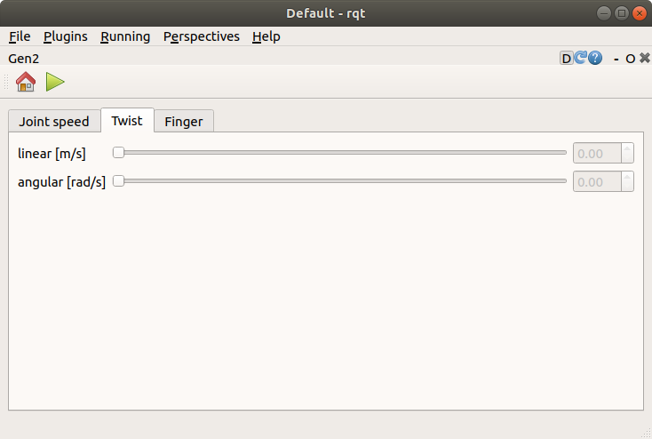
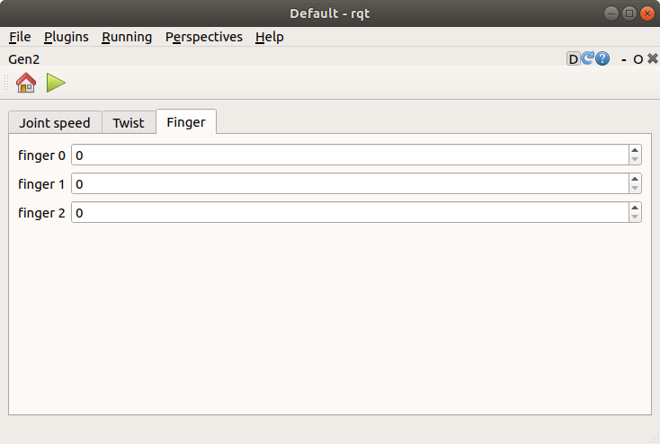

Gen2(experimental)
==================

ここでは、Gen2(experimental)の使い方を説明します。Gen2(experimental)は、`Kinova社のGen2 <https://www.kinovarobotics.com/product/gen2-robots>`_ に対して指示するためのrqtの拡張機能です。

.. image:: images/gen2.png

Gen2(experimental)の起動
------------------------

Gen2(experimental)を起動する手順は次のとおりです。

 1. メインメニュー「Plugins」-「Robot Tools」-「Gen2(experimental)」を選択する

各関節の角速度の指示
--------------------

Joint speedタブでは、各関節の角速度の指示することができます。各関節の角速度を指示する手順は次のとおりです。

 1. Joint speedタブを選択する
 2. joint 1 [deg/s]〜joint 6 [deg/s]に任意の数値を入力する
 3. ＋または−ボタンを押して各関節の角速度を指示する

.. image:: images/gen2.png

グリッパの位置・姿勢の指示
--------------------------

Twistタブでは、グリッパの位置・姿勢を指示することができます。グリッパの位置・姿勢を指示する手順は次のとおりです。

 1. Twistタブを選択する
 2. linear [m/s]とangular [rad/s]に任意の数値を入力する
 3. PCに接続したゲームパッドの軸（左スティックと十字キー）からグリッパの位置・姿勢を指示する

グリッパの位置の指示とグリッパの姿勢の指示は、ゲームパッドのボタン（Xbox コントローラーの場合はBボタン、DUALSHOCK 4の場合は○ボタン）を押すことで切り替えることができます。

フィンガの開閉
--------------

Fingerタブでは、フィンガの開閉を指示することができます。フィンガの開閉を指示する手順は次のとおりです。

 1. Fingerタブを選択する
 2. finger 0〜finger 2に任意の数値（0〜6800）を入力する（0のときに全閉、6800のときに全開）
 3. ツールバーの▶ボタンを押してフィンガの開閉を指示する

