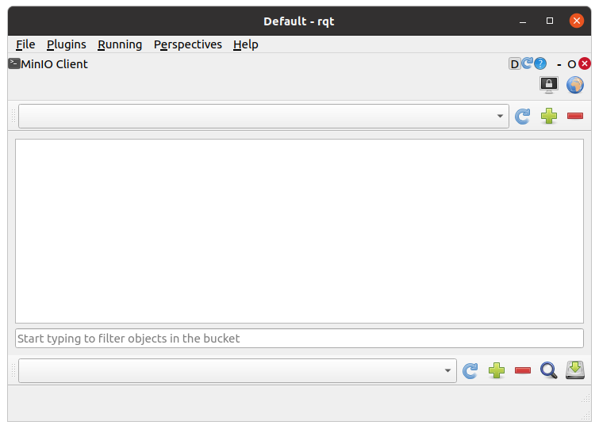
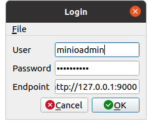
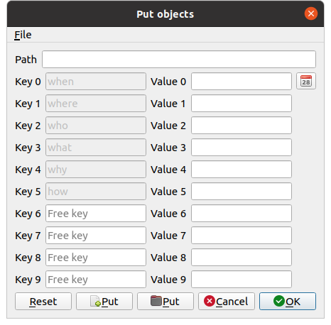
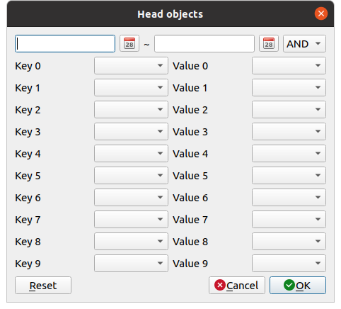

MinIO Client
============

ここでは、MinIO Clientの使い方を説明します。MinIO Clientは、オブジェクトストレージMinIOのオブジェクトを操作するrqtの拡張機能です。

MinIO Clientの起動
------------------

MinIO Clientを起動する手順は次のとおりです。

 1. メインメニュー「Plugins」-「Miscellaneous Tools」-「MinIO Client」を選択する

ユーザ情報の認証
----------------

MinIOのサーバに接続するためのユーザ情報を設定します。ユーザ情報を設定する手順は次のとおりです。

 1. 画面右上のボタン（ディスプレイがロックされているアイコン）を押す
 2. 表示されたダイアログにUser、Password、Endpointを入力する
 3. ダイアログのOkボタンを押す

MinIOのサーバのUser、Passwordの初期値は「minioadmin」です。EndpointはMinIOのサーバの管理者に確認して入力ください。
ユーザ情報の認証が成功すると、画面上部のコンボボックスからMinIOのサーバ上にあるバケットを選択できるようになります。
 

バケットの作成
--------------

バケットを新たに作成する場合は、次の手順で行います。

 1. ツールバー（上）右の＋ボタンを押す
 2. 表示されたダイアログにバケット名を入力する
 3. ダイアログのOkボタンを押す

.. image:: images/create_bucket.png

ファイルのアップロード
----------------------

MinIOのサーバにファイルをアップロード（プット）する場合は、次の手順で行います。

 1. ツールバー（下）右の＋ボタンを押す
 2. 表示されたダイアログにPathを入力する（任意）
 3. Key、Valueを入力する（Value 0〜Value 5は必須）
 4. ダイアログのPutボタンを押してアップロードするファイルまたはフォルダを選択する
 5. ダイアログのOkボタンを押す

オブジェクトのダウンロード
--------------------------

MinIOのサーバからファイルをダウンロード（ゲット）する場合は、次の手順で行います。

 1. ダウンロードしたいオブジェクトにチェックをいれる
 2. ツールバー（下）右のハードディスクボタンを押す
 3. オブジェクトの保存先を入力する
 4. ダイアログのOkボタンを押す

オブジェクトの抽出
------------------

MinIOのサーバ上のオブジェクトを抽出（検索）する場合は、次の手順で行います。

 1. ツールバー（下）右のボタン（ルーペのアイコン）を押す
 2. 期間を入力する（例：20231109）
 3. 抽出の種類（AND/OR）を選択する
 4. Keyを選択する（任意）
 5. 3.で選択したKeyのValueを選択する
 6. ダイアログのOkボタンを押す
 
オブジェクトの抽出が成功すると、オブジェクトのリストが表示されます。

