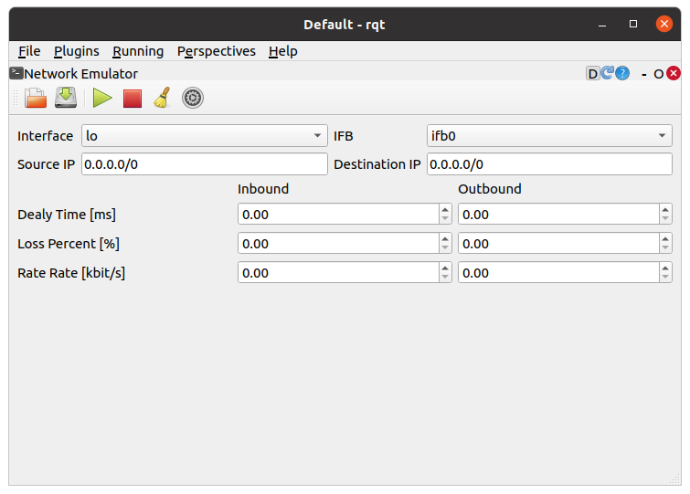
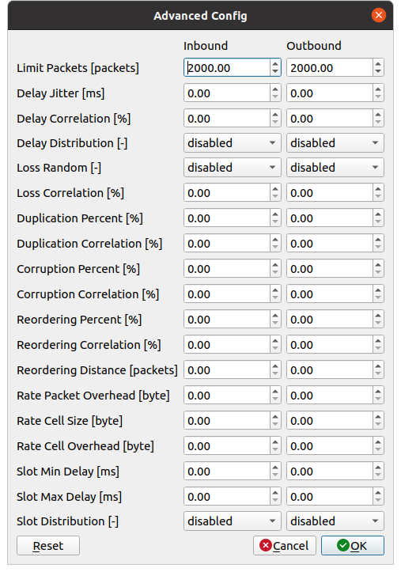

Network Emulator
================

ここでは、Network Emulatorの使い方を説明します。Network Emulatorは、広域ネットワークのプロパティを模擬してプロトコルをテストする（ネットワーク上に擬似的に通信障害の効果を与える）rqtの拡張機能です。

Network Emulatorの起動
----------------------

Network Emulatorを起動する手順は次のとおりです。

 1. メインメニュー「Plugins」-「Miscellaneous Tools」-「Network Emulator」を選択する

プロパティの模擬
----------------

プロパティを模擬する手順は次のとおりです。

 1. 各プロパティに任意の値を入力する
 2. ツールバーの▶ボタンを押してプロパティを適用する（もう一度押すとプロパティが解除される）

Network Emulatorでは、以下のプロパティを設定することができます。

.. list-table::
  :widths: 20,12,12,75
  :header-rows: 1

  * - パラメータ
    - デフォルト値
    - 単位
    - 意味
  * - Interface
    - lo
    - \-
    - パケットの送信に使用するインタフェースを指定します
  * - IFB
    - ifb0
    - \-
    - パケットの受信に使用するインタフェースを指定します
  * - Source IP
    - 0.0.0.0/0
    - \-
    - パケットの送信元を限定する際のIPアドレスを指定します
  * - Destination IP
    - 0.0.0.0/0
    - \-
    - パケットの送信先を限定する際のIPアドレスを指定します
  * - Inbound/Outbound Delay Time
    - 0.00
    - ms
    - パケットを受信する／送信する際の遅延時間を指定します
  * - Inbound/Outbound Loss Percent
    - 0.00
    - %
    - パケットを受信する／送信する際のパケット損失率を指定します   
  * - Rate Rate
    - 0.00
    - kbit\s
    - パケットを受信する／送信する際のレイテンシ（通信速度の上限）を指定します

高度な設定
----------

Network Emulatorでは、以下を設定することができます。詳細については、`こちら <https://man7.org/linux/man-pages/man8/tc-netem.8.html>`_ を参照してください。

