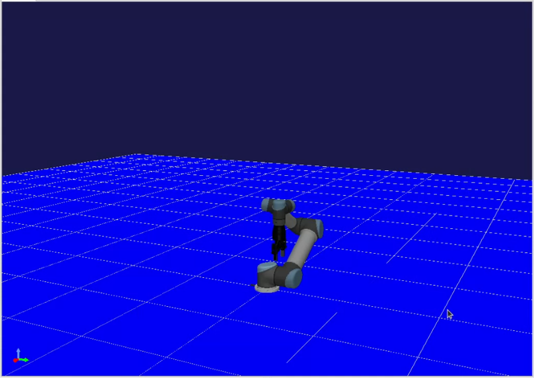
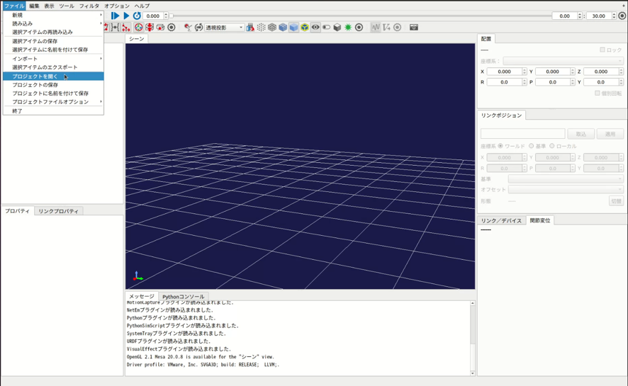
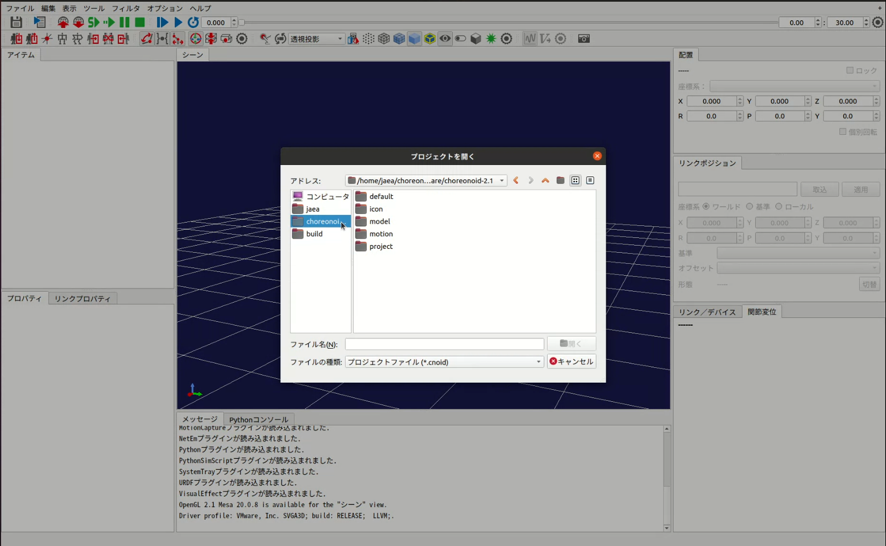

URサンプルについて
==================

URロボットは、`ユニバーサルロボット <https://www.universal-robots.com/ja/%E8%A3%BD%E5%93%81%E3%83%A9%E3%82%A4%E3%83%B3%E3%83%8A%E3%83%83%E3%83%97/>`_ 社によって開発された協働ロボットアームです。Choreonoidには、URロボットのUR3、UR5、UR10のボディモデルが含まれており、シミュレーションに利用することができます。本サンプルでは、このURロボットのモデルをゲームパッドで操作する実装例を提供しています。なお、本サンプルはあくまで実装例としてURロボットをゲームパッドで操作できるようにしたものであり、実際のURロボットはゲームパッドを使って直接操作することはできませんのでご注意ください。

ビルド方法
----------
本サンプルのビルドは、HAIROWorldPluginのビルドと同時に行われます。HAIROWorldPluginのビルドが完了していない場合は、 `ソースコードからのビルドとインストール <https://k38-suzuki.github.io/hairo-world-plugin-doc/install/install.html>`_ を参照して、HAIROWorldPluginをビルドしてください。

サンプルプロジェクトの紹介
--------------------------
以下の3つのサンプルプロジェクトが用意されています。

 - UR3.cnoid
 - UR5.cnoid
 - UR10.cnoid

サンプルプロジェクトは以下の手順で読み込むことができます。ここでは例として、UR5のサンプルプロジェクトを読み込みます。
 1. 「メニュー」-「ファイル」-「プロジェクトを開く」を選択する。
 2. ダイアログ左の「choreonoid」を選択する。
 3. 「project」を選択する。 
 4. 任意のプロジェクトを選択し、ダイアログ右下の「開く」を押す。 
  

.. image:: images/ur_step3.png

.. image:: images/ur_step4.png

プロジェクトが読み込まれると以下のように表示されます。

.. image:: images/ur_step5.png

いずれもプレイステーション4用のDUALSHOCK4を使用して操作できます。キーの割当は以下のとおりです。

 - 左スティック前後　・・・　URロボットのベースリンク（BASE）を基準に、手先（WRIST3）を前／後に移動
 - 左スティック左右　・・・　URロボットのベースリンク（BASE）を基準に、手先（WRIST3）を左／右に移動
 - 十字キー前後　・・・　URロボットのベースリンク（BASE）を基準に、手先（WRIST3）を上／下に移動
 - ×ボタン　・・・　ホームポジションに戻る　※実機のポームポジションとは異なります。

.. note:: ChoreonoidがサポートしているロジクールのF310、Xbox用コントローラ及びXbox360用コントローラでは動作未確認のため、URロボットを正常に操作できない可能性がありますので、ご注意ください。

