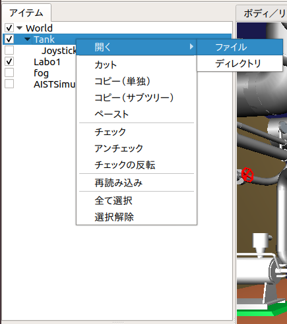

ボディアイテムのファイル表示
============================

ここでは、ボディアイテムのファイルとファイルのあるディレクトリの開き方を説明します。

ファイルとディレクトリの開き方
--------------------------------

以下の手順でファイル及びディレクトリを開きます。

1. アイテムツリービュー上でボディアイテムを選択する。（複数選択可）
2. 選択したボディアイテム上で右クリックして、ポップアップメニューを表示する。
3. ポップアップメニューの「開く」を選択する。
4. ファイルを開く場合は「ファイル」、ディレクトリを開く場合は「ディレクトリ」を選択する。

