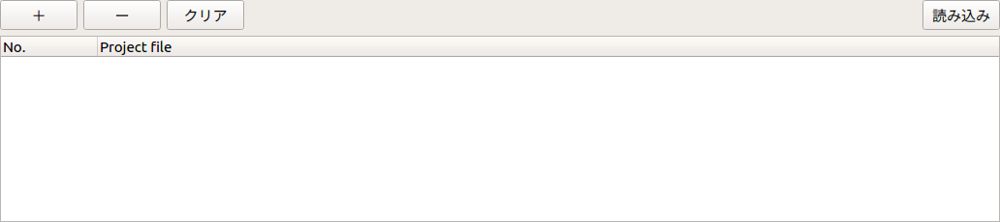

プロジェクトのブックマーク登録
==============================

ここでは、プロジェクトのブックマーク登録の仕方を説明します。
この機能は、複数のプロジェクトの紐付けを行うもので、例えばプロジェクトAにプロジェクトBをブックマーク登録すると、プロジェクトAからプロジェクトBへの遷移を簡単に行なえます。さらに、プロジェクトBにプロジェクトAをブックマーク登録すると、プロジェクトAとプロジェクトBを交互に切り替えられます。

プロジェクトの登録
------------------

以下の手順でブックマークを登録します。

1. 「メニュー」-「表示」-「ビューの表示」から「ブックマークマネージャ」を選択する。
2. ビュー上の「＋」を押し、表示されるダイアログから登録するプロジェクトを選択する。
3. ダイアログ上の「読み込み」を押し、ビューにプロジェクトが登録される。

下図は、ブックマークマネージャのビューです。

プロジェクトの解除
------------------

以下の手順でブックマークを解除します。

1. 「メニュー」-「表示」-「ビューの表示」から「ブックマークマネージャ」を選択する。
2. 登録を解除するプロジェクトをビュー上で選択する。
3. ビュー上の「-」を押し、プロジェクトの登録が解除される。

ブックマークのクリア
--------------------

以下の手順でブックマークをクリア（全て解除）します。

1. 「メニュー」-「表示」-「ビューの表示」から「ブックマークマネージャ」を選択する。
2. 登録を解除するプロジェクトをビュー上で選択する。
3. ビュー上の「クリア」を押し、プロジェクトの登録が全て解除される。

プロジェクトの読み込み
----------------------

以下の手順でブックマーク登録されているプロジェクトを読み込みます。

1. 「メニュー」-「表示」-「ビューの表示」から「ブックマークマネージャ」を選択する。
2. 読み込むプロジェクトをビュー上で選択する。
3. ビュー上の「読み込み」を押し、プロジェクトが読み込まれる。

