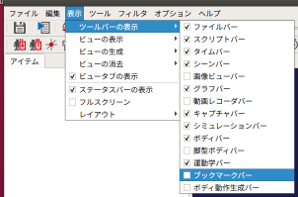
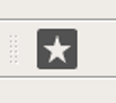
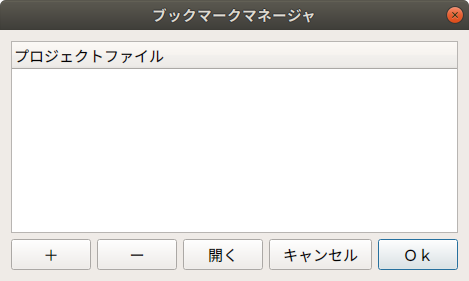

プロジェクトのお気に入り登録
============================

ここでは、プロジェクトのお気に入り登録の仕方を説明します。この機能は、使用頻度の高いプロジェクトをお気に入りとして登録して、簡易に開けるようにするものです。

ブックマークバーの表示
----------------------

以下の手順で「ブックマークバー」を表示します。

1. 「メニュー」-「表示」-「ツールバーの表示」から「ブックマークバー」を選択する。

ブックマークマネージャの表示
----------------------------

以下の手順で「ブックマークマネージャ」を表示します。

1. ブックマークバーのアイコンを押す。

下図は、ブックマークバーのアイコンです。

アイコンを押すと、下図のダイアログが表示されます。

ブックマークの登録
------------------

以下の手順でブックマークを登録します。

1. ブックマークマネージャの「＋」を押す。
2. 表示されたダイアログからプロジェクトを選択する。
3. ダイアログの「開く」を押す。

ブックマークの削除
------------------

以下の手順でブックマークを削除します。

1. ブックマークマネージャのリストからプロジェクトを選択する。
2. ブックマークマネージャの「ー」を押す。

プロジェクトを開く
------------------

以下の手順でブックマークに登録されているプロジェクトを開きます。

1. ブックマークマネージャのリストからプロジェクトを選択する。
2. ブックマークマネージャの「開く」を押す。

