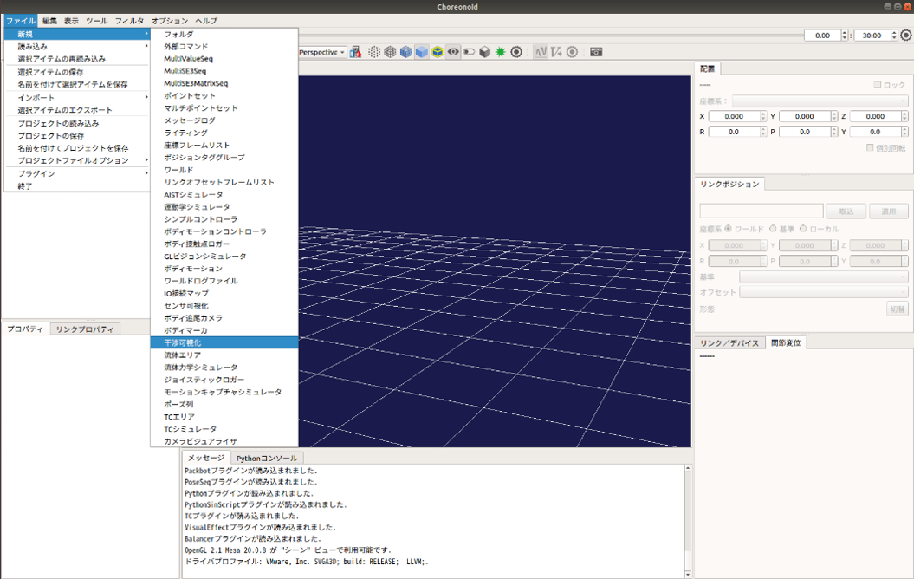

干渉の可視化・記録
==================

ここでは、シミュレーションに使用している動的モデルの干渉の表示と記録の仕方を説明します。この機能では、動的モデルのリンク毎の干渉を可視化するためのものです。リンクが他の物体に干渉している場合は、そのリンクの干渉モデルの色が赤色に、干渉していない場合は白色に変更されます。また、この機能では、動的モデルのリンク毎の干渉を記録し、ファイル出力することができます。

干渉の可視化・記録の設定
------------------------

干渉の可視化・記録を行うCollisionVisualizerを生成します。
ここでは、Choreonoidの標準のシミュレータアイテムである「AISTシミュレータ」を用います。メインメニューの「ファイル」-「新規」-「干渉可視化」を選択して「CollisionVisualizer」生成してください。生成したCollisionVisualizerは、AISTシミュレータアイテムの小アイテムとして配置します。

また、CollisionVisualizerでは以下の設定ができます。

.. list-table::
  :widths: 20,12,8,75
  :header-rows: 1

  * - パラメータ
    - デフォルト値
    - 単位
    - 意味
  * - 対象ボティ
    - \
    - \-
    - 干渉を可視化するボディを指定します。指定がない場合は、全てのボティが対象になります。複数選択する場合は、スペース区切りで指定します。
  * - 干渉の記録
    - false
    - \-
    - trueの場合に干渉を記録します。

干渉を記録するときは、以下の手順でCollisionVisualizerの設定を変更します。可視化のみ場合は、設定の変更は不要です。

1. アイテムツリービュー上で「CollisionVisualizer」を選択する。
2. プロパティビュー上で「干渉の記録」の設定を「true」に変更する。

コリジョンセンサの設定
----------------------

CollisionVisualizerでは、リンクの干渉を可視化するためにコリジョンセンサを使用します。

コリジョンセンサは、カメラやライト等と同様に任意のリンクのelements以下に記述します。

.. code-block:: yaml

      -
        type: CollisionSensor
        name: CollisionSensor
        translation: [ 0.0, 0.0, 0.0 ]
        rotation: [ 0, 1, 0, 0 ]
        color: [ 1.0, 0.0, 0.0 ]

各キーの詳細は以下の通りです。

.. list-table::
  :widths: 20,12,8,75
  :header-rows: 1

  * - パラメータ
    - デフォルト値
    - 単位
    - 意味
  * - color
    - 1.0, 0.0, 0.0
    - -, -, -
    - 干渉しているときのリンクの色を指定します。

シミュレーションの実行
----------------------

シミュレーションバーから通常通りシミュレーションを実行してください。シミュレーションに成功すると、コリジョンセンサが取り付けられているリンクが、他のオブジェクトと干渉しているときにリンクの色がコリジョンセンサのパラメータで指定した色に変更されます。また、干渉を記録している場合は、ボディの干渉を記録したアイテム「Collision States」がCollisionVisualizerの小アイテムとして自動生成されます。

.. image:: images/collision_1.png

干渉のファイル出力
------------------

以下の手順で記録した干渉をファイル出力します。

1. シミュレーション実行後に自動生成されたアイテム「Collision States」を選択する。
2. 「メニュー」-「ファイル」から「選択したアイテムのエクスポート」を選択する。
3. 表示されるダイアログにファイル名を入力し、「保存」ボタンを押す。

干渉のグラフ表示
----------------

以下の手順で記録した干渉をグラフ表示できます。

1. 「メニュー」-「表示」-「ビューの表示」から「Multi Value Seq」を選択する。
2. グラフ表示を行うアイテム「Collision States」を選択する。
3. Multi Value Seqビューの左側に表示されている数字（jointId）を選択する。

