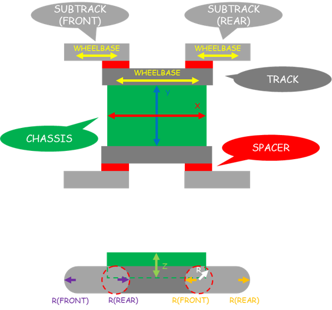

クローラロボットの生成
======================

ここでは、クローラロボットビルダを使ったクローラロボットのモデルファイルの生成の仕方を説明します。

クローラロボットの構造
----------------------

クローラロボットビルダでは、下図の構造のクローラロボットのモデルファイルを生成します。

クローラロボットの作成
----------------------

以下の手順で、クローラロボットのモデルファイルを作成します。

1. 「メニュー」 - 「ツール」から「クローラロボットビルダ」を選択する。
2. ダイアログの各項目の数値を入力する。
3. ダイアログの「ボディの保存」押す。
4. モデルファイルの名前を入力し、保存場所を指定する。

下図は、クローラロボットビルダのダイアログです。

.. image:: images/crawler_1.png

各項目に入力した数値を保存する場合は、ダイアログ上の「YAMLの保存」を押し、YAMLファイルを出力します。出力したYAMLファイルをダイアログ上の「YAMLの読み込み」から読み込むことで、各項目に入力した数値が復元されます。

