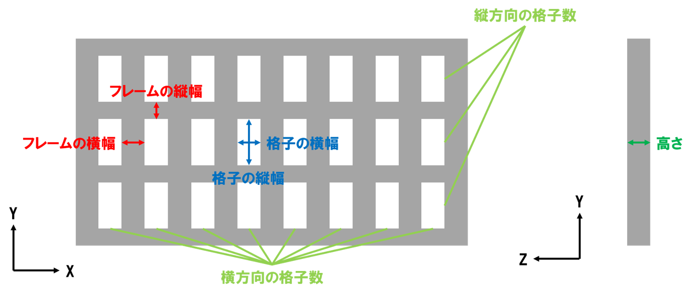
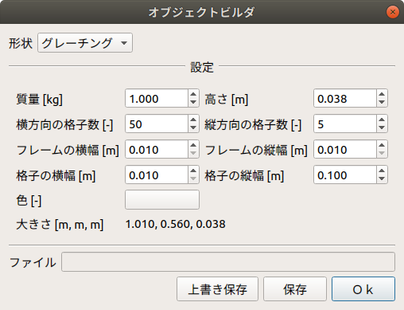

グレーチングモデルの生成
========================

ここでは、オブジェクトビルダを使ったグレーチングモデルの生成の仕方を説明します。

グレーチングモデルの構造とパラメータ
------------------------------------

下図は、グレーチングモデルの構造です。

グレーチングモデルの作成
------------------------

以下の手順でグレーチングモデルを作成します。

1. 「メニュー」-「ツール」から「オブジェクトビルダ」を選択する。
2. ダイアログ上の「形状」から「グレーチング」を選択する。
3. 「設定」の各パラメータを入力し、「生成」を押す。上書きの場合は、「上書き保存」を押す。

下図は、オブジェクトビルダのダイアログです。

