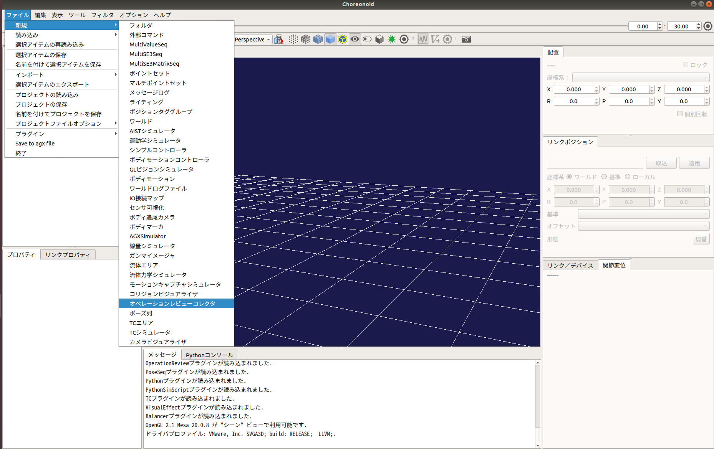

ジョイスティックの入力状態の記録
================================

ここでは、ジョイスティックの入力状態の記録の仕方を説明します。この機能は、接続されているジョイスティック（/dev/input/js0のみ対応）のスティックとボタンの入力状態を記録するものです。ジョイスティックが接続されていない場合は、「仮想ジョイスティック」からの入力を記録できます。

ジョイスティックの入力状態の記録の設定
--------------------------------------

ジョイスティックの入力状態の記録を行うオペレーションレビューコレクタを生成します。
ここでは、Choreonoidの標準のシミュレータアイテムである「AISTシミュレータ」を用います。メインメニューの「ファイル」-「新規」-「オペレーションレビューコレクタ」を選択して生成してください。生成したオペレーションレビューコレクタは、AISTシミュレータアイテムの小アイテムとして配置します。

次に、以下の手順でオペレーションレビューコレクタの設定を変更してください。

1. アイテムツリービュー上で「OperationReviewCollector」を選択する。
2. プロパティビュー上で「ジョイスティック状態の記録」の設定を「true」に変更する。

オペレーションレビューコレクタの設定の詳細は以下のとおりです。

.. list-table::
  :widths: 20,12,8,75
  :header-rows: 1

  * - パラメータ
    - デフォルト値
    - 単位
    - 意味
  * - ジョイスティック状態の記録
    - false
    - \-
    - trueの場合にジョイスティックの入力状態を時系列データとして記録します。
  * - 接触状態の記録
    - false
    - \-
    - trueの場合に接触状態を時系列データとして記録します。

シミュレーションの実行
----------------------

シミュレーションバーから通常通りシミュレーションを実行してください。シミュレーションに成功すると、ジョイスティックの入力状態を記録したアイテム「Joystick States」がオペレーションレビューコレクタの小アイテムとして自動生成されます。

ジョイスティックの入力状態のファイル出力
----------------------------------------

以下の手順で記録したジョイスティックの入力状態をファイル出力します。

1. シミュレーション実行後に自動生成されたアイテム「Joystick States」を選択する。
2. 「メニュー」-「ファイル」から「選択したアイテムのエクスポート」を選択する。
3. 表示されるダイアログにファイル名を入力し、「保存」ボタンを押す。

なお、出力したファイルには、ジョイスティックの入力状態が全スティック-全ボタンの順番で記録されます。
（例えば、スティック（Axis）が8入力、ボタン(Button)が13入力のジョイスティックを使用している場合は、Axis-0, Axis-1, ..., Axis-7, Button-0, Button-1, ..., Button-12の順番で記録されます。）

ジョイスティックの入力状態のグラフ表示
--------------------------------------

以下の手順で記録したジョイスティックの入力状態をグラフ表示できます。

1. 「メニュー」-「表示」-「ビューの表示」から「Multi Value Seq」を選択する。
2. グラフ表示を行うアイテム「Joystick States」を選択する。
3. Multi Value Seqビューの左側に表示されている数字を選択する。

Multi Value Seqビューの左側に表示されている数字は、ジョイスティックの各スティック・ボタンに対応しており、全スティック-全ボタンの順番で割り当てられています。
（例えば、スティック（Axis）が8入力、ボタン(Button)が13入力のジョイスティックを使用している場合は、Axis-0, Axis-1, ..., Axis-7, Button-0, Button-1, ..., Button-12の順番で数字が割り当てられ、0から7はスティック、8から20はボタンを表します。）

