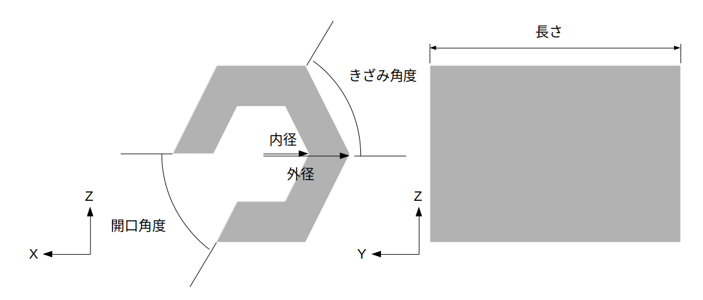

パイプモデルの生成
==================

ここでは、オブジェクトビルダを使ったパイプモデルの生成の仕方を説明します。

パイプモデルの構造とパラメータ
------------------------------

下図は、パイプモデルの構造です。

パイプモデルの作成
------------------

以下の手順でパイプモデルを作成します。

1. 「メニュー」-「ツール」から「オブジェクトビルダ」を選択する。
2. ダイアログ上の「形状」から「パイプ」を選択する。
3. 「設定」の各パラメータを入力し、「生成」を押す。上書きの場合は、「上書き保存」を押す。

下図は、オブジェクトビルダのビューです。

.. image:: images/pipe_1.png
