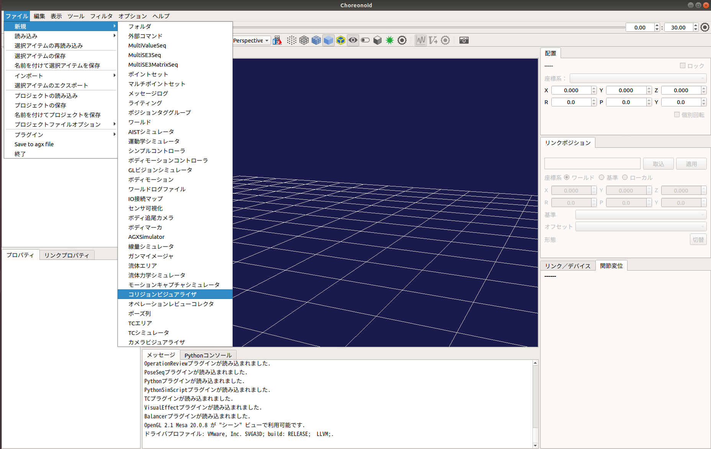
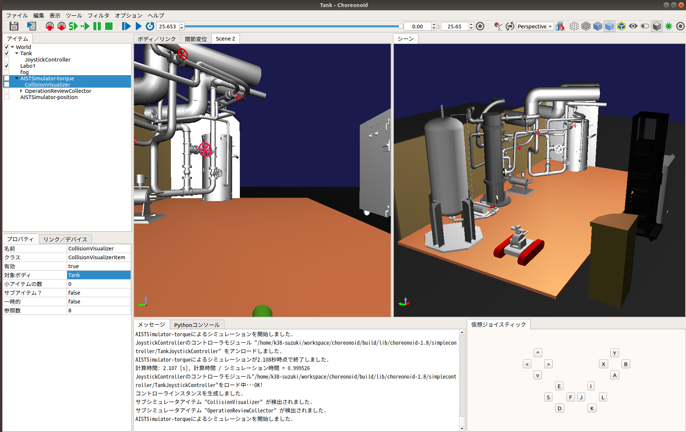

接触状態の可視化・記録
======================

ここでは、シミュレーションに使用している動的モデルの接触状態の表示と記録の仕方を説明します。この機能では、動的モデルのリンク毎の接触状態を可視化するためのものです。リンクが他の物体に接触している場合は、そのリンクの干渉モデルの色が赤色に、接触していない場合は白色に変更されます。また、この機能では、動的モデルのリンク毎の接触状態を時系列データとして記録し、ファイル出力することができます。

接触状態の可視化の設定
----------------------

接触状態の可視化を行うコリジョンビジュアライザアイテムを生成します。
ここでは、Choreonoidの標準のシミュレータアイテムである「AISTシミュレータ」を用います。メインメニューの「ファイル」-「新規」-「コリジョンビジュアライザ」を選択して生成してください。生成したコリジョンビジュアライザは、AISTシミュレータアイテムの小アイテムとして配置します。

また、コリジョンビジュアライザでは以下の設定ができます。

.. list-table::
  :widths: 20,12,8,75
  :header-rows: 1

  * - パラメータ
    - デフォルト値
    - 単位
    - 意味
  * - 対象ボティ
    - \
    - \-
    - 接触状態を可視化するボディを指定します。指定がない場合は、全てのボティが対象になります。複数選択する場合は、スペース区切りで指定します。

次に、ツールバーに表示されている「干渉チェック用モデルを表示」または「表示するモデルタイプの切り替え」のアイコンを押し、干渉モデルを表示します。

接触状態の記録の設定
--------------------

接触状態の記録を行うオペレーションレビューコレクタを生成します。
ここでは、Choreonoidの標準のシミュレータアイテムである「AISTシミュレータ」を用います。メインメニューの「ファイル」-「新規」-「オペレーションレビューコレクタ」を選択して生成してください。生成したオペレーションレビューコレクタは、AISTシミュレータアイテムの小アイテムとして配置します。

次に、以下の手順でオペレーションレビューコレクタの設定を変更してください。

1. アイテムツリービュー上で「OperationReviewCollector」を選択する。
2. プロパティビュー上で「接触状態の記録」の設定を「true」に変更する。

.. image:: images/review_1.png

オペレーションレビューコレクタの設定の詳細は以下のとおりです。

.. list-table::
  :widths: 20,12,8,75
  :header-rows: 1

  * - パラメータ
    - デフォルト値
    - 単位
    - 意味
  * - ジョイスティック状態の記録
    - false
    - \-
    - trueの場合にジョイスティックの入力状態を時系列データとして記録します。
  * - 接触状態の記録
    - false
    - \-
    - trueの場合に接触状態を時系列データとして記録します。

シミュレーションの実行
----------------------

シミュレーションバーから通常通りシミュレーションを実行してください。シミュレーションに成功すると接触が検知されたリンクの干渉モデルが赤色に表示されます。また、接触状態を記録している場合は、ボディの接触状態を記録したアイテム「Collision States」がオペレーションレビューコレクタの小アイテムとして自動生成されます。

接触状態のファイル出力
----------------------

以下の手順で記録した接触状態をファイル出力します。

1. シミュレーション実行後に自動生成されたアイテム「Collision States」を選択する。
2. 「メニュー」-「ファイル」から「選択したアイテムのエクスポート」を選択する。
3. 表示されるダイアログにファイル名を入力し、「保存」ボタンを押す。

接触状態のグラフ表示
--------------------

以下の手順で記録した接触状態をグラフ表示できます。

1. 「メニュー」-「表示」-「ビューの表示」から「Multi Value Seq」を選択する。
2. グラフ表示を行うアイテム「Collision States」を選択する。
3. Multi Value Seqビューの左側に表示されている数字（jointId）を選択する。

