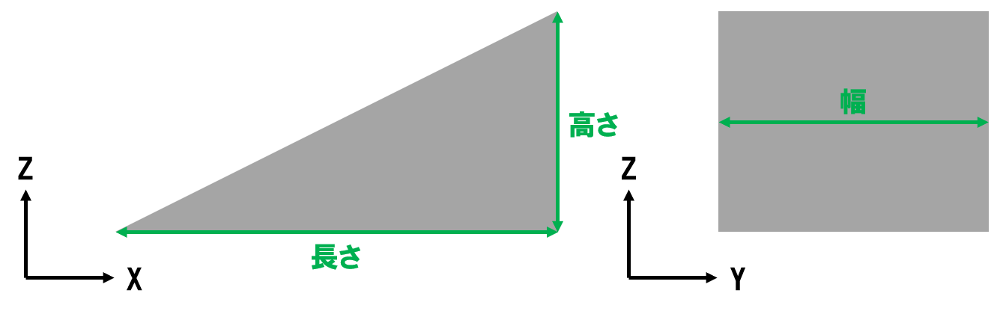
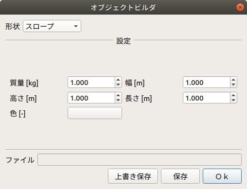

スロープモデルの生成
====================

ここでは、オブジェクトビルダを使ったスロープモデルの生成の仕方を説明します。

スロープモデルの構造とパラメータ
--------------------------------

下図は、スロープモデルの構造です。

スロープモデルの作成
--------------------

以下の手順でスロープモデルを作成します。

1. 「メニュー」-「ツール」から「オブジェクトビルダ」を選択する。
2. ダイアログ上の「形状」から「スロープ」を選択する。
3. 「設定」の各パラメータを入力し、「Save As...」を押す。上書きの場合は、「Save」を押す。

下図は、オブジェクトビルダのダイアログです。

