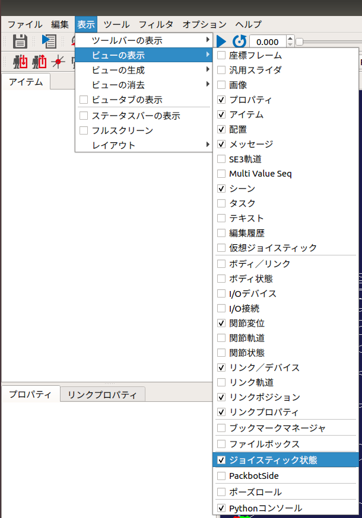
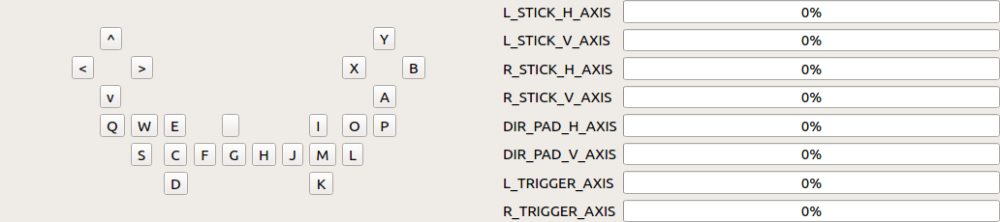

ジョイスティックの入力状態の表示
================================

ここでは、ジョイスティックの入力状態の表示の仕方を説明します。この機能は、接続されているジョイスティック（/dev/input/js0のみ対応）のスティックとボタンの入力状態を表示するものです。また、この機能を使用すると「仮想ジョイスティック」と同様にキーボードからジョイスティックの入力を行うこともできます。

入力状態の表示
--------------

以下の手順でジョイスティックの入力状態を表示するビューを表示します。

1. 「メニュー」-「表示」-「ビューの表示」から「ジョイスティックステータス」を選択する。

下図は、ジョイスティックステータスのビューです。

