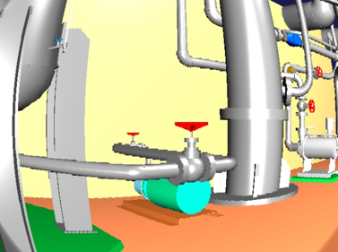

カメラ画像のシミュレーション
============================

ここでは、VFXビジョンシミュレータを使ったカメラ画像のシミュレートの仕方を説明します。

画像ビューの生成
----------------

VFXビジョンシミュレータによって視覚効果が付与されたカメラ画像は、「画像ビュー」に表示されます。
メインメニューの「表示」-「ビューの表示」-「画像」から画像ビューを生成してください。

画像ビューバーの生成
--------------------

シミュレートするカメラの選択には、画像ビューバーを使用します。メインメニュー「表示」-「ツールバーの表示」-「画像ビューバー」から画像ビューバーを生成してください。

マルチコライダアイテムの設定
----------------------------

マルチコライダアイテムは、カメラ画像に視覚効果を付与する領域を定義するためのアイテムです。メインメニューの「ファイル」-「新規」-「マルチコライダ」を選択して生成してください。生成したマルチコライダアイテムは、ワールドアイテムの子アイテム、またはボディアイテムの子アイテムとして配置します。ワールドアイテムの子アイテムとした場合は、そのマルチコライダアイテムで指定した領域にカメラが設定されたリンクが進入すると、カメラ画像に視覚効果が付与されます。また、ボディアイテムの子アイテムとした場合は、ボディの移動に同期してマルチコライダアイテムも移動するようになり、常にカメラ画像に視覚効果が付与されます。

視覚効果は、マルチコライダアイテムのプロパティを変更することで設定できます。プロパティを変更するときは、アイテムツリービューで任意のマルチコライダアイテムを選択して、プロパティビュー上でパラメータを変更してください。以下は、カメラ画像に視覚効果を付与する領域と、カメラ画像に付与する視覚効果を設定するためのマルチコライダのプロパティです。

.. list-table::
  :widths: 20,12,12,75
  :header-rows: 1

  * - パラメータ
    - デフォルト値
    - 単位
    - 意味
  * - 色相
    - 0
    - \-
    - 色相を調整します。（0.0~1.0）
  * - 彩度
    - 0
    - \-
    - 彩度を調整します。（0.0~1.0）
  * - 明度
    - 0
    - \-
    - 明度を調整します。（0.0~1.0）
  * - 赤
    - 0
    - \-
    - 赤色の輝度を調整します。（0.0~1.0）
  * - 緑
    - 0
    - \-
    - 緑色の輝度を調整します。（0.0~1.0）
  * - 青
    - 0
    - \-
    - 青色の輝度を調整します。（0.0~1.0）
  * - 歪み
    - 0
    - \-
    - 樽型歪みの度合いを調整します。（-1.0~0.0）
  * - 拡大率
    - 0
    - \-
    - 拡大率を調整します。（1.0~32.0）
  * - 標準偏差
    - 1
    - \-
    - ガウシアンノイズの度合いを調整します。(0.0~1.0)
  * - 白色ノイズの量
    - 0
    - \-
    - カメラ画像中の白色ノイズの量を調整します。(0.0~1.0)
  * - 白色ノイズの確率
    - 0
    - \-
    - 白色ノイズをカメラ画像に付与する確率を調整します。(0.0~1.0)
  * - 黒色ノイズの量
    - 0
    - \-
    - カメラ画像中の黒色ノイズの量を調整します。(0.0~1.0)
  * - 黒色ノイズの確率
    - 0
    - \-
    - 黒色ノイズをカメラ画像に付与する確率を調整します。(0.0~1.0)
  * - モザイクの確率
    - 0
    - \-
    - モザイクをカメラ画像に付与する確率を調整します。(0.0~1.0)
  * - モザイクのサイズ
    - 0
    - \-
    - モザイクのサイズを調整します。(8~64)
  * - 形状
    - Box
    - \-
    - 領域の形状を指定します。(Box/Cylinder/Sphere)
  * - サイズ
    - 1.0, 1.0, 1.0
    - m, m, m
    - 領域のサイズをXYZで指定します。（形状がBoxの場合のみ）
  * - 半径
    - 1.0
    - m
    - 領域の半径を指定します。（形状がCylinder・Sphereの場合のみ）
  * - 高さ
    - 1.0
    - m
    - 領域の高さを指定します。（形状がCylinderの場合のみ）
  * - 位置
    - 0, 0, 0
    - m, m, m
    - 領域の位置をXYZで指定します。
  * - RPY
    - 0, 0, 0
    - deg, deg, deg
    - 領域の向きをRoll, Pitch, Yawで指定します。
  * - 拡散色
    - 0, 0, 0
    - \-, -, -
    - 領域の拡散色ををRGBで指定します。
  * - 透過度
    - 0
    - \-
    - 領域の透過度を指定します。

VFXビジョンシミュレータの作成と設定
-----------------------------------

VFXビジョンシミュレータは、カメラ画像に視覚効果を付与するためのアイテムです。VFXビジョンシミュレータは、ChoreonoidのGLビジョンシミュレータを継承したアイテムとなっており、カメラ画像の生成＋視覚効果の付与を行います。ここではChoreonoidの標準のシミュレータアイテムである「AISTシミュレータ」を用います。メインメニューの「ファイル」-「新規」-「VFXビジョンシミュレータ」を選択して生成してください。VFXビジョンシミュレータはAISTシミュレータアイテムの子アイテムとして配置します。次に、メインメニューの「ファイル」-「新規」-「センサ可視化」を選択してセンサビジュアライザを生成してください。生成したセンサビジュアライザをは、任意のボディアイテムの子アイテムとして配置します。ボディアイテムの子アイテムにセンサビジュアライザをを設定すると、ボディに設定されているカメラ毎にCameraImageVisualizerItemが自動生成されます。この自動生成されたアイテムのチェックボックスにチェックしたカメラが、画像ビューバーのコンボボックスに登録されます。

VFXビジョンシミュレータでの視覚効果の付与について、VFXビジョンシミュレータでは、上記のマルチコライダのプロパティで示した「色相（H）・彩度（S）・明度（V）」、「赤（R）・緑（G）・青（B）」、「歪み」、「拡大率」、「ガウシアンノイズ」、「ゴマ塩ノイズ（白色ノイズ・黒色ノイズ）」、「モザイク」を付与することができます。一方で、これらの視覚効果を全てカメラ画像に付与しようとすると、画像処理にかかる演算負荷が大きくなり、シミュレーションが実時間で進行しないことを確認しています。そこでVFXビジョンシミュレータでは、演算負荷が比較的に小さい白色ノイズのみを付与するモード「白色ノイズのみ」、モザイクのみを付与するモード「モザイクのみ」と、全ての視覚効果を付与するモード「全て」に分けて、VFXビジョンシミュレータのプロパティからユーザが選択できるようにしています。デフォルトの設定では「白色ノイズのみ」が選択されています。また、「全て」を選択した場合でも、「白色ノイズの確率」と「黒色ノイズの確率」の値を小さく設定することで、演算負荷が軽減し、シミュレーションが実時間で進行できる場合もあります。

シミュレーションの実行
----------------------

シミュレーションバーから通常通りシミュレーションを実行してください。任意の画像ビューを選択し、画像ビューバーのコンボボックスからカメラを選択するとカメラ画像が表示されます。
以下は、歪みを-0.3、拡大率を1.7とした場合のカメラ画像の例です。

