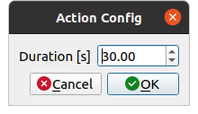

UR(experimental)
================

ここでは、UR(experimental)の使い方を説明します。UR(experimental)は、`ユニバーサルロボット社のUR5e <https://www.universal-robots.com/products/ur5-robot/>`_ に対して各関節の角度を指示するためのrqtの拡張機能です。

.. image:: images/ur.png

UR(experimental)の起動
----------------------

UR(experimental)を起動する手順は次のとおりです。

 1. メインメニュー「Plugins」-「Robot Tools」-「UR(experimental)」を選択する

各関節の角度の指示
------------------

各関節の角度を指示する手順は次のとおりです。

 1. ツールバーの＋ボタンを押してリストに行を追加する、または−ボタンを押してリストから行を削除する
 2. 追加した行のjoint 1 [deg]〜joint 6 [deg]とduration [s]に任意の数値を入力する
 3. ツールバーの▶ボタンを押して各関節の角度を指示する
 
各パラメータは、次のとおりです。

.. list-table::
  :widths: 20, 12, 12, 75
  :header-rows: 1
  
  * - パラメータ
    - デフォルト値
    - 単位
    - 意味
  * - joint 1~6
    - \-
    - deg
    - 各関節の角度を指定します。joint 1~6は、順にshoulder_pan_joint、shoulder_lift_joint、elbow_joint、wrist_1_joint、wrist_2_joint、wrist_3_jointに対応しています
  * - duration
    - \-
    - s
    - 現在の姿勢から次の姿勢までの状態遷移の時間を指定します

▶ボタンを押すと、リストの上から順にUR5eに対して各関節の角度が指示されます。

リストの保存
------------

リストを保存する手順は以下のとおりです。なお、リストの設定はJSON（.json）形式で保存されます。

 1. ツールバーのハードディスクボタンを押して保存する

リストの読み込み
----------------

リストを読み込む手順は以下のとおりです。

 1. ツールバーのディレクトリボタンを押して、読み込みたいファイル（.json）を読み込む

UR(experimental)の設定
----------------------

UR(experimental)では、以下の設定をすることができます。

.. list-table::
  :widths: 20, 12, 12, 75
  :header-rows: 1
  
  * - パラメータ
    - デフォルト値
    - 単位
    - 意味
  * - duration
    - 30
    - s
    - 各関節の角度を指示したときのサーバの待ち時間を指定します

